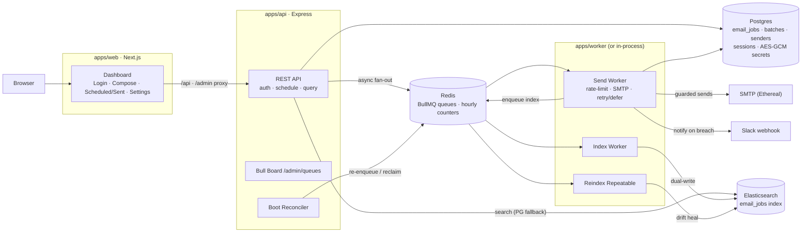
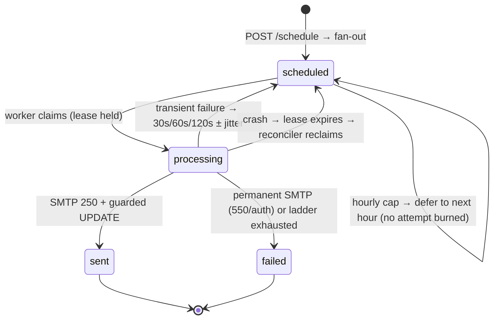

# ReachInbox — Email Job Scheduler & Dashboard

**A production-grade email scheduling engine that never loses, duplicates, or silently drops an email** — with a real-time dashboard for users and engineers.

- Schedule thousands of emails with **BullMQ delayed jobs**, precisely paced.
- Throttle like a deliverability-conscious sender: **dual hourly caps** (tenant + sender) + per-batch pacing.
- Survive crashes mid-send with **exactly-once delivery** — `kill -9`, restart, and the batch finishes exactly where it left off.
- Watch everything live: queue depths, rate counters, every state transition.


##  Live deployment (Render)

- **Dashboard (Next.js):** https://reachinbox-web-kugh.onrender.com
- **API health (Express):** https://reachinbox-api-1187.onrender.com/api/health
- **Bull Board (auth-gated):** https://reachinbox-web-kugh.onrender.com/admin/queues

What the deployed topology looks like:

- `reachinbox-api` — one always-on **free web service** running the API **with all BullMQ workers in-process** (`WORKER_INPROCESS=true`).
- `reachinbox-web` — one **free web service** running the Next.js dashboard; `/api` and `/admin` proxy to the API so the browser talks to one origin and cookies stay first-party.
- `reachinbox-kv` — Render **Key Value** (Redis-compatible) for BullMQ queues + hourly rate counters.
- **Neon Postgres** (external) — job truth, sessions, AES-encrypted secrets; no 30-day expiry.
- **Elasticsearch** — deliberately **disabled** on the free tier; search falls back to Postgres with identical results. Set `ELASTICSEARCH_URL` anytime to enable ES with **zero code changes**.

Free-tier behavior to expect:

- Web services spin down after ~15 minutes idle; the first request wakes one in ~50 seconds.
- The boot reconciler re-enqueues anything missed across a cold start — spin-downs are survivable by design.
- Full deployment walkthrough (OAuth, secrets, verification): **[DEPLOY.md](DEPLOY.md)**.

## Highlights

- **Restart-safe by construction** — Postgres owns job truth; a boot reconciler re-enqueues anything Redis lost and reclaims stale processing leases.
- **Exactly-once sends** — deterministic job IDs (`sha256(batchId:recipient)`), DB status re-checked under a lease before every SMTP send, guarded state transitions.
- **Rate limits defer, never drop** — one atomic Lua script enforces tenant-wide **and** per-sender hourly caps; an over-cap send slides to the next hour window with **zero attempts burned**.
- **Smart retries** — transient SMTP failures (421/450/451/452) climb a `30s → 60s → 120s ± jitter` ladder; permanent failures (550/auth) fail fast.
- **Search that never breaks the product** — Elasticsearch is a read optimization with a Postgres fallback; the whole engine runs with ES disabled.
- **Real OAuth, hardened** — Google login with PKCE (S256) + nonce + session-bound state; redirect URIs auto-derive from the browsing origin.
- **No cron, anywhere** — periodic drift correction is a BullMQ *repeatable* job, Redis-backed like everything else.
- **Secrets encrypted at rest** — SMTP passwords and Slack tokens are AES-256-GCM; the key lives only in env.
- **Live queue dashboard** — Bull Board at `/admin/queues`, auth-gated by the same session that protects the API.

## Architecture




### Job lifecycle



## The guarantees — and how they work

- **Deterministic jobs** — `sha256(batchId + ":" + recipient).slice(0, 32)`; re-adding the same recipient is a no-op.
- **Restart safety** — boot reconciler re-enqueues `scheduled` rows missing from Redis, reclaims stale `processing` leases; a Redis mutex prevents double-run.
- **No double-send** — the worker re-reads DB status under the lease before sending; `sent` is a guarded UPDATE; redeliveries of `sent` jobs are acked and skipped.
- **Atomic rate limiting** — one Lua script checks-then-increments every applicable counter; rejection happens *before* increment so counters never diverge.
- **Deferral, never drop** — on cap: status stays `scheduled`, `scheduled_at` slides to the next hour window, `moveToDelayed` keeps the job queued with no attempt burned.
- **Transient vs permanent** — 421/450/451/452 + connection errors → backoff ladder; 550/551/553/554/auth → immediate `discard()`.
- **CSV hygiene** — recipients deduped + validated before scheduling; skipped rows reported back to the user.
- **Slack never blocks sending** — token read at notify-time; failures logged and swallowed.
- **ES drift self-heals** — index-queue dual-write + repeatable reindex pass + same-request Postgres fallback.

## State ownership

| Concern | Owner | Why |
|---|---|---|
| Job existence & status | **Postgres** `email_jobs` | Every transition is a guarded SQL UPDATE; Redis is never the truth |
| Timing, counters, fan-out | **Redis / BullMQ** | Deterministic jobIds make re-enqueue idempotent; counters move in one Lua script or not at all |
| Read / search | **Elasticsearch** (optional) | Written only by the index worker; API falls back to Postgres when ES is down or unset |
| Env policy | `packages/config` | Parsed once, typed, shared — no duplicated defaults anywhere |
| Contracts | `packages/shared-types` | The same zod schemas validate API input and type the dashboard |
| Secrets | Postgres (AES-256-GCM) | Key only in `ENCRYPTION_KEY` env; one encrypt/decrypt path |
| Sessions | Postgres `session` | Server-side; `requireAuth` re-reads the user on every request |

## Features

- **Google OAuth sign-in** — PKCE (S256) + nonce + session-bound state; per-origin redirect derivation (no more `redirect_uri_mismatch`).
- **Compose & schedule** — subject/body with attachments, CSV upload or manual recipients, per-batch pacing (`delay between sends`) and optional per-batch hourly cap.
- **Scheduled / Sent / Failed views** — live counts, batch drill-down, per-recipient status, retry and failure reasons.
- **Full-text search** — by subject and recipient; ES when enabled, Postgres otherwise, identical UX.
- **Slack integration** — per-tenant OAuth; rate-limit breach notifications that never block the send path.
- **Admin queue board** — Bull Board behind session auth for real-time queue inspection.

## Repository structure

```
├── apps/
│   ├── api/                          # Express REST API (long-lived)
│   │   └── src/
│   │       ├── server.ts             # entry: boot reconciler → listen (+ optional in-process workers)
│   │       ├── app.ts                # middleware, routers, Bull Board, /api/health diagnostics
│   │       ├── session.ts            # PG-backed sessions (connect-pg-simple)
│   │       ├── middleware/           # requireAuth · validateBody · apiRateLimit · errorHandler
│   │       ├── reconciler/           # bootReconciler — re-enqueue + lease reclaim on start
│   │       └── modules/
│   │           ├── auth/             # Google OAuth: PKCE + nonce, per-origin redirect derivation
│   │           ├── schedule/         # schedule API, CSV recipient parsing, attachment store
│   │           ├── query/            # lists/detail/search — ES-first, PG fallback
│   │           └── integrations/slack/  # Slack OAuth + status/disconnect
│   ├── worker/                       # BullMQ worker pool (standalone process)
│   │   └── src/
│   │       ├── index.ts              # process wrapper (signals)
│   │       ├── workers.ts            # startWorkers() — send/index/reindex workers, one owner
│   │       ├── processors/
│   │       │   ├── sendWorker.ts     # the send state machine
│   │       │   ├── indexWorker.ts    # PG → ES dual-write
│   │       │   └── reindexWorker.ts  # drift correction pass
│   │       ├── mailer/               # Nodemailer transport + HMAC-fetched attachments
│   │       └── slack/                # breach notifications (never blocks sending)
│   └── web/                          # Next.js 15 + Tailwind dashboard
│       └── src/
│           ├── app/                  # login · (dashboard): lists/detail/settings · compose
│           ├── components/           # shell/Sidebar · emails/* · compose/ComposeForm · ui/*
│           └── lib/                  # typed API client + shared DTO types
├── packages/
│   ├── db-schema/                    # canonical DDL, pg pool, AES-256-GCM crypto, jobId
│   │   ├── schema.sql                # tenants · senders · batches · email_jobs · session
│   │   └── src/scripts/              # migrate · seed · seedEthereal · verifySenders
│   ├── queues/                       # the engine: queues, scheduler, reconciler
│   │   └── src/
│   │       ├── scheduler.ts          # deterministic fan-out (expandBatch)
│   │       ├── rateLimiter.ts        # atomic Lua: tenant+sender(+batch) counters
│   │       ├── reconciler.ts         # shared by API boot + worker boot
│   │       ├── sendPolicy.ts         # pure retry/defer/fail decision + delay
│   │       ├── smtpErrors.ts         # transient vs permanent taxonomy
│   │       └── backoff.ts            # 30s/60s/120s ± jitter ladder
│   ├── search/                       # ES client — mapping, idempotent upsert, queries,
│   │                                 #   and the single "is ES available" policy
│   ├── shared-types/                 # zod schemas + DTOs shared FE↔BE (+ recipients parser)
│   └── config/                       # typed env policy — every limit env-driven
├── infra/
│   ├── docker/                       # Dockerfiles (api · worker · web)
│   └── render/                       # predeploy.sh (migrate+seed) · boot-setup.sh
├── scripts/
│   ├── e2e.mjs                       # 26-check end-to-end verification harness (local)
│   ├── e2e-cloud.mjs                 # full cloud E2E against the deployed Render stack
│   ├── e2e-cloud-nosmtp.mjs          # non-SMTP cloud E2E (14 checks)
│   ├── render-deploy.mjs             # API-driven Render deploy orchestrator
│   ├── smtp-probe.mjs                # SMTP reachability + credential probe
│   └── reconcile-once.mjs            # one reconciliation pass (hands-on demo)
├── docker-compose.yml                # postgres + redis(AOF) + elasticsearch (+ apps)
├── render.yaml                       # Render Blueprint: Key Value + 2 web services
└── DEPLOY.md                         # deployment guide (Render free tier + OAuth setup)
```

## Quickstart (local)

Prereqs: **Docker** and **Node 20+**.

```bash
pnpm install
cp .env.example .env
# Fill in:
#   GOOGLE_CLIENT_ID / GOOGLE_CLIENT_SECRET   (real OAuth — login has no bypass)
#   SLACK_* (optional — breach notifications)
docker compose up -d postgres redis elasticsearch
pnpm db:migrate && pnpm db:seed
pnpm db:seed:ethereal      # provisions REAL Ethereal SMTP accounts via api.nodemailer.com
pnpm db:verify:senders     # proves every sender passes a real SMTP handshake + AUTH

pnpm dev:api      # :3001 — runs the boot reconciler first
pnpm dev:worker   # BullMQ workers — same
pnpm dev:web      # :3000 — proxies /api and /admin/queues to :3001
```

- Open **http://localhost:3000** → Login with Google → Compose.
- Mail is delivered through **Ethereal** (Nodemailer's test SMTP — nothing reaches the public internet; every message is viewable at ethereal.email with the seeded credentials).
- **60-second restart-safety demo:** schedule a batch with a large delay-between-sends → `docker compose kill worker` mid-batch → restart it. The boot reconciler re-enqueues everything Postgres says is unfinished, reclaims stale leases, and the batch completes with every job `sent` exactly once.
- Single-service mode: `WORKER_INPROCESS=true` runs the same workers inside the API process (`pnpm start` in `apps/api`) — exactly how the Render deployment runs.

## Configuration reference

Every limit is environment-driven — nothing hardcoded:

| Variable | Purpose | Default |
|---|---|---|
| `DATABASE_URL` | Postgres connection string | — |
| `REDIS_URL` | Redis (AOF enabled in compose) | `redis://localhost:6379` |
| `ELASTICSEARCH_URL` | ES endpoint — empty/`disabled` runs PG-fallback mode | *(empty)* |
| `WORKER_INPROCESS` | Run BullMQ workers inside the API process | `false` |
| `WORKER_CONCURRENCY` | Send-worker concurrency | `10` |
| `MAX_EMAILS_PER_HOUR` / `…_PER_SENDER` | Hourly caps (tenant default / sender default) | `500` / `100` |
| `MIN_DELAY_BETWEEN_SENDS_MS` | Reserved pacing floor; per-batch delay is set in Compose | `2000` |
| `RETRY_MAX_ATTEMPTS` / `RETRY_BASE_DELAYS_MS` / `RETRY_JITTER_PCT` | Retry ladder | `4` / `30000,60000,120000` / `0.2` |
| `RECONCILE_LEASE_TIMEOUT_MS` | Processing lease honored before reclaim | `300000` |
| `REINDEX_INTERVAL_SECONDS` | Drift-correction repeatable interval | `900` |
| `QUEUE_PREFIX` | BullMQ key prefix (isolate environments) | `reachinbox` |
| `GOOGLE_CLIENT_ID/SECRET/REDIRECT_URI` | Google OAuth (redirect URI auto-derives when unset) | — |
| `SLACK_CLIENT_ID/SECRET/REDIRECT_URI` | Slack OAuth | — |
| `SESSION_SECRET` / `ENCRYPTION_KEY` | Cookie signing / AES-256-GCM (64 hex) | — |
| `COOKIE_SECURE` | Set `true` behind HTTPS | `false` |

Cap resolution, most specific wins — all enforced atomically across **all** applicable counters in one Lua script:

- Per-row overrides on `tenants` and `senders`.
- Per-batch override via `hourlyLimit` in Compose.
- Tenant-wide default from `MAX_EMAILS_PER_HOUR`.

## Verification

```bash
pnpm test                  # unit: recipients parser, backoff ladder, rate-window keys,
                           # SMTP taxonomy, deterministic jobId, OAuth redirect policy
node scripts/e2e.mjs       # 26-check E2E against the real local stack (API + worker running)
node scripts/e2e-oauth.mjs # 26-check OAuth harness: Google + Slack flows over real HTTP
```

The E2E harness exercises, in order:

- Session auth → CSV upload (with dupe/invalid feedback) → attachment upload.
- Two live batches — one with `hourlyLimit=2` to force a real deferral — through real SMTP delivery.
- ES search by subject and recipient → detail view + nav counts.
- Bull Board auth gate → Slack graceful-absence path.
- **Redis `FLUSHALL` mid-flight:** lists still served from Postgres, reconciler re-enqueues everything, the recovery batch still delivers.
- Logout invalidation.

Cloud verification (against the deployed Render stack):

- `node scripts/e2e-cloud.mjs` — full pass including SMTP delivery.
- `node scripts/e2e-cloud-nosmtp.mjs` — 14/14 checks covering every non-SMTP surface.
- `scripts/reconcile-once.mjs` — runs a single reconciliation pass for hands-on demos.

## Known issue — SMTP egress on Render free instances

- Render blocks outbound ports **25 / 465 / 587** on free web services (platform policy); the deployment seeds Ethereal senders on port **2525**, the sanctioned alternate submission port.
- As of 2026-09-11, `smtp.ethereal.email:2525` accepts TCP but stalls before its banner (an upstream Ethereal outage) — so free instances currently cannot deliver mail until that recovers.
- The engine behaves correctly meanwhile: transient failures climb the retry ladder, rows end `failed` (or defer under a rate cap), and the reconciler re-enqueues missed work after restarts.
- Fixes when needed: upgrade the API service to a paid plan (unblocks 587), or swap the transport for an HTTP email API — the worker depends only on the `MailTransport` interface, so this is a one-module change (`apps/worker/src/mailer/`).
