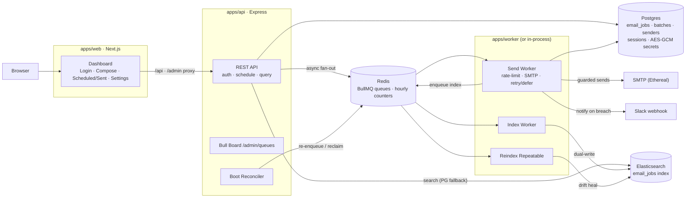
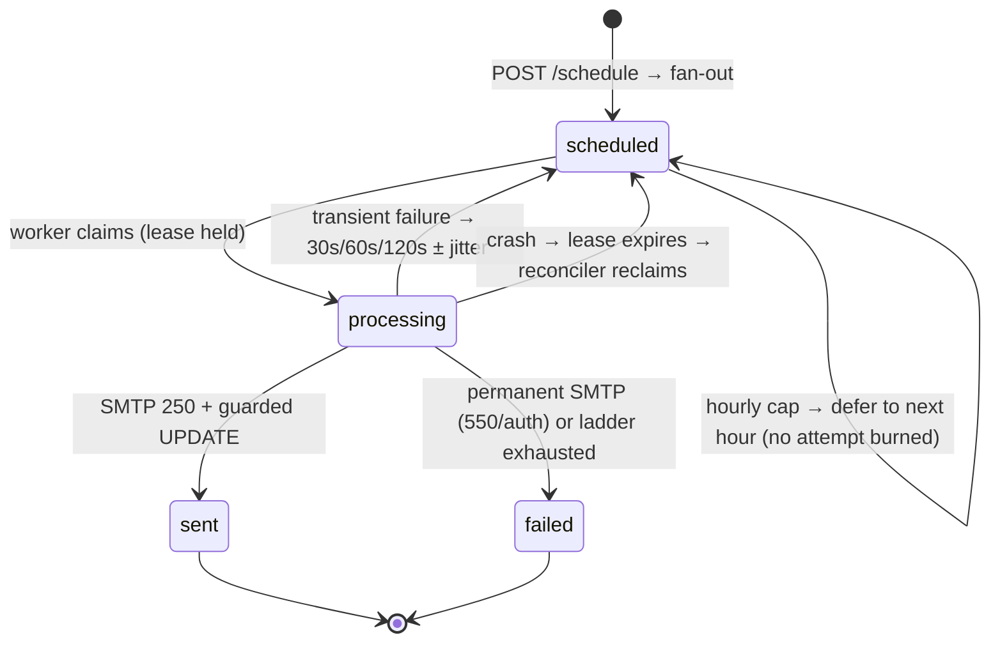

# ReachInbox — Email Job Scheduler & Dashboard

**A production-grade email scheduling engine that never loses, duplicates, or silently drops an email** — with a real-time dashboard for users and engineers.

Schedule thousands of emails precisely with BullMQ delayed jobs, throttle them like a deliverability-conscious sender (dual hourly caps + per-batch pacing), survive crashes mid-send with **exactly-once delivery**, and watch everything live — queue depths, rate counters, every state transition.

**Verified end-to-end, not claimed:** a 26-check E2E harness drives the real HTTP API, real SMTP (Ethereal), real Elasticsearch, and a live Redis-loss disaster — including killing Redis mid-batch and proving the reconciler re-enqueues everything from Postgres with zero duplicates and zero lost leads.

---

## Highlights

- **Restart-safe by construction** — Postgres owns job truth; a boot reconciler re-enqueues anything Redis lost and reclaims stale processing leases. `kill -9` mid-batch, restart, and the batch finishes exactly where it left off.
- **Exactly-once sends** — deterministic job IDs (`sha256(batchId:recipient)`), DB status re-checked under a lease before every SMTP send, guarded state transitions.
- **Rate limits defer, never drop** — one atomic Lua script enforces tenant-wide **and** per-sender hourly caps; an over-cap send slides to the next hour window with **zero attempts burned**.
- **Smart retries** — transient SMTP failures (421/450/451/452) climb a 30s → 60s → 120s ± jitter ladder; permanent failures (550/auth) fail fast.
- **Search that never breaks the product** — Elasticsearch is a read optimization with a Postgres fallback; the whole engine runs with ES disabled (default on free hosting).
- **Real OAuth, hardened** — Google login with PKCE (S256) + nonce + session-bound state; redirect URIs auto-derive from the browsing origin (kills the classic `redirect_uri_mismatch`).
- **No cron, anywhere** — periodic drift correction is a BullMQ *repeatable* job, Redis-backed like everything else.
- **Secrets encrypted at rest** — SMTP passwords and Slack tokens are AES-256-GCM; the key lives only in env.

## Architecture



**One rule ties it together:** the send path never touches Elasticsearch; the read path never mutates job state. Postgres is the record of intent and outcome; Redis is the mechanism that makes it happen on time; ES is a cache you can delete.

### Job lifecycle



## Repository structure

```
├── apps/
│   ├── api/                          # Express REST API (long-lived)
│   │   └── src/
│   │       ├── server.ts             # entry: boot reconciler → listen (+ optional in-process workers)
│   │       ├── app.ts                # middleware, routers, Bull Board, /api/health diagnostics
│   │       ├── session.ts            # PG-backed sessions (connect-pg-simple)
│   │       ├── middleware/           # requireAuth · validateBody · apiRateLimit · errorHandler
│   │       ├── reconciler/           # bootReconciler — re-enqueue + lease reclaim on start
│   │       └── modules/
│   │           ├── auth/             # Google OAuth: PKCE + nonce, per-origin redirect derivation
│   │           ├── schedule/         # schedule API, CSV recipient parsing, attachment store
│   │           ├── query/            # lists/detail/search — ES-first, PG fallback (§7.3)
│   │           └── integrations/slack/  # Slack OAuth + status/disconnect
│   ├── worker/                       # BullMQ worker pool (standalone process)
│   │   └── src/
│   │       ├── index.ts              # process wrapper (signals)
│   │       ├── workers.ts            # startWorkers() — send/index/reindex workers, one owner
│   │       ├── processors/
│   │       │   ├── sendWorker.ts     # the send state machine (FR-12–21)
│   │       │   ├── indexWorker.ts    # PG → ES dual-write
│   │       │   └── reindexWorker.ts  # drift correction pass
│   │       ├── mailer/               # Nodemailer transport + HMAC-fetched attachments
│   │       └── slack/                # breach notifications (never blocks sending)
│   └── web/                          # Next.js 15 + Tailwind dashboard
│       └── src/
│           ├── app/                  # login · (dashboard): lists/detail/settings · compose
│           ├── components/           # shell/Sidebar · emails/* · compose/ComposeForm · ui/*
│           └── lib/                  # typed API client + shared DTO types
├── packages/
│   ├── db-schema/                    # canonical DDL, pg pool, AES-256-GCM crypto, jobId
│   │   ├── schema.sql                # tenants · senders · batches · email_jobs · session
│   │   └── src/scripts/              # migrate · seed · seedEthereal · verifySenders
│   ├── queues/                       # the engine: queues, scheduler, reconciler
│   │   └── src/
│   │       ├── scheduler.ts          # deterministic fan-out (expandBatch)
│   │       ├── rateLimiter.ts        # atomic Lua: tenant+sender(+batch) counters
│   │       ├── reconciler.ts         # shared by API boot + worker boot
│   │       ├── smtpErrors.ts         # transient vs permanent taxonomy
│   │       └── backoff.ts            # 30s/60s/120s ± jitter ladder
│   ├── search/                       # ES client — mapping, idempotent upsert, queries,
│   │                                 #   and the single "is ES available" policy
│   ├── shared-types/                 # zod schemas + DTOs shared FE↔BE (+ recipients parser)
│   └── config/                       # typed env policy — every limit env-driven
├── infra/
│   ├── docker/                       # Dockerfiles (api · worker · web)
│   └── render/predeploy.sh           # idempotent migrate + seed for Render deploys
├── scripts/
│   ├── e2e.mjs                       # 26-check end-to-end verification harness
│   └── reconcile-once.mjs            # one reconciliation pass (FR-9/10/11 demo)
├── docker-compose.yml                # postgres + redis(AOF) + elasticsearch (+ apps)
├── render.yaml                       # Render Blueprint: free PG + KV + 2 services
└── DEPLOY.md                         # deployment guide (Render free tier + OAuth setup)
```

## State ownership

| Concern | Owner | Why |
|---|---|---|
| Job existence & status | **Postgres** `email_jobs` | Every transition is a guarded SQL UPDATE; Redis is never the truth |
| Timing, counters, fan-out | **Redis / BullMQ** | Deterministic jobIds make re-enqueue idempotent; counters move in one Lua script or not at all |
| Read / search | **Elasticsearch** (optional) | Written only by the index worker; API falls back to Postgres when ES is down or unset |
| Env policy | `packages/config` | Parsed once, typed, shared — no duplicated defaults anywhere |
| Contracts | `packages/shared-types` | The same zod schemas validate API input and type the dashboard |
| Secrets | Postgres (AES-256-GCM) | Key only in `ENCRYPTION_KEY` env; one encrypt/decrypt path |
| Sessions | Postgres `session` | Server-side; `requireAuth` re-reads the user on every request |

## Quickstart (local)

Prereqs: **Docker** and **Node 20+**.

```bash
pnpm install
cp .env.example .env
# Fill in:
#   GOOGLE_CLIENT_ID / GOOGLE_CLIENT_SECRET   (real OAuth — login has no bypass)
#   SLACK_* (optional — breach notifications)
docker compose up -d postgres redis elasticsearch
pnpm db:migrate && pnpm db:seed
pnpm db:seed:ethereal      # provisions REAL Ethereal SMTP accounts via api.nodemailer.com
pnpm db:verify:senders     # proves every sender passes a real SMTP handshake + AUTH

pnpm dev:api      # :3001 — runs the boot reconciler first
pnpm dev:worker   # BullMQ workers — same
pnpm dev:web      # :3000 — proxies /api and /admin/queues to :3001
```

Open **http://localhost:3000** → Login with Google → Compose. Mail is delivered
through Ethereal (Nodemailer's test SMTP — nothing reaches the public internet;
every message is viewable at ethereal.email with the seeded credentials).

**The 60-second restart-safety demo:** schedule a batch with a large
delay-between-sends → `docker compose kill worker` mid-batch → restart it. The
boot reconciler re-enqueues everything Postgres says is unfinished, reclaims
stale leases, and the batch completes with every job `sent` exactly once.

Single-service mode: `WORKER_INPROCESS=true` runs the same workers inside the
API process (`pnpm start` in `apps/api`) — how the Render deployment works.

## Deployment — Render (free tier)

`render.yaml` is a complete [Blueprint](DEPLOY.md): free Postgres + free
Key Value (Redis-compatible) + two free web services — the API with workers
in-process, and the Next.js dashboard. Elasticsearch stays **disabled** on the
free tier by design (the search package owns that policy; Postgres serves every
read) — set `ELASTICSEARCH_URL` anytime to light ES up with zero code changes.

```bash
# After connecting the GitHub repo:
# Render Dashboard → New → Blueprint → Apply → fill the prompted secrets.
```

`DEPLOY.md` walks through OAuth redirect URIs (the `/api/health` endpoint prints
the exact URIs to register in Google Cloud Console), free-tier behavior
(spin-down/wake, 30-day Postgres), and verification steps.

## Configuration reference

Every limit is environment-driven — nothing hardcoded:

| Variable | Purpose | Default |
|---|---|---|
| `DATABASE_URL` | Postgres connection string | — |
| `REDIS_URL` | Redis (AOF enabled in compose) | `redis://localhost:6379` |
| `ELASTICSEARCH_URL` | ES endpoint — empty/`disabled` runs PG-fallback mode | *(empty)* |
| `WORKER_INPROCESS` | Run BullMQ workers inside the API process | `false` |
| `WORKER_CONCURRENCY` | Send-worker concurrency | `10` |
| `MAX_EMAILS_PER_HOUR` / `…_PER_SENDER` | Hourly caps (tenant default / sender default) | `500` / `100` |
| `MIN_DELAY_BETWEEN_SENDS_MS` | Reserved pacing floor; per-batch delay is set in Compose | `2000` |
| `RETRY_MAX_ATTEMPTS` / `RETRY_BASE_DELAYS_MS` / `RETRY_JITTER_PCT` | Retry ladder | `4` / `30000,60000,120000` / `0.2` |
| `RECONCILE_LEASE_TIMEOUT_MS` | Processing lease honored before reclaim | `300000` |
| `REINDEX_INTERVAL_SECONDS` | Drift-correction repeatable interval | `900` |
| `QUEUE_PREFIX` | BullMQ key prefix (isolate environments) | `reachinbox` |
| `GOOGLE_CLIENT_ID/SECRET/REDIRECT_URI` | Google OAuth (redirect URI auto-derives when unset) | — |
| `SLACK_CLIENT_ID/SECRET/REDIRECT_URI` | Slack OAuth | — |
| `SESSION_SECRET` / `ENCRYPTION_KEY` | Cookie signing / AES-256-GCM (64 hex) | — |
| `COOKIE_SECURE` | Set `true` behind HTTPS | `false` |

Caps also resolve per-row (`tenants`, `senders`) and per-batch (`hourlyLimit`
in Compose) — most specific wins, enforced atomically across **all** applicable
counters in one Lua script.

## How the guarantees work

| Guarantee | Mechanism |
|---|---|
| Deterministic jobs | `sha256(batchId + ":" + recipient).slice(0,32)` — re-adding is a no-op |
| Restart safety | Boot reconciler: re-enqueues `scheduled` rows missing from Redis, reclaims stale `processing` leases, Redis mutex prevents double-run |
| No double-send | Worker re-reads DB status under the lease before sending; `sent` is a guarded UPDATE; redeliveries of `sent` jobs are acked and skipped |
| Atomic rate limiting | One Lua script checks-then-increments every applicable counter — reject *before* increment so counters never diverge |
| Deferral, never drop | On cap: status stays `scheduled`, `scheduled_at` → next hour window, `moveToDelayed` keeps the job queued with **no attempt burned** |
| Transient vs permanent | 421/450/451/452 + connection errors → backoff ladder; 550/551/553/554/auth → `discard()` immediately |
| CSV hygiene | Deduped + validated before scheduling; skipped rows reported to the user |
| Slack never blocks sending | Token read at notify-time; failures logged and swallowed |
| ES drift | Index-queue dual-write + repeatable reindex + same-request Postgres fallback |

## Verification

```bash
pnpm test                # unit: recipients parser, backoff ladder, rate-window keys,
                         # SMTP taxonomy, deterministic jobId
node scripts/e2e.mjs     # 26-check E2E against the real stack (API + worker running)
```

The E2E harness exercises: session auth → CSV upload (with dupe/invalid
feedback) → attachment upload → two live batches (one with `hourlyLimit=2` to
force deferral) → real SMTP delivery → ES search by subject and recipient →
detail view + nav counts → Bull Board auth gate → Slack graceful-absence path →
**Redis `FLUSHALL` mid-flight: lists still served from Postgres, reconciler
re-enqueues everything, the recovery batch still delivers** → logout
invalidation. `scripts/reconcile-once.mjs` runs a single reconciliation pass
for hands-on FR-9/10/11 demos.

## FR traceability

| FRs | Where |
|---|---|
| FR-1–3 · Google OAuth, header, logout | `apps/api/src/modules/auth`, `apps/web/src/app/login` |
| FR-4–6 · Schedule API, validation, async fan-out | `apps/api/src/modules/schedule`, `packages/queues/scheduler` |
| FR-7–9 · BullMQ-only, deterministic IDs, DB truth + reconcile | `packages/queues` (queues, jobId, reconciler) |
| FR-10–12 · Restart persistence, recovery, explicit states | `packages/queues/reconciler`, `apps/worker/src/processors/sendWorker` |
| FR-13–15 · Ethereal sending, multi-sender, retry/backoff | `apps/worker/src/mailer`, `packages/queues/{smtpErrors,backoff}` |
| FR-16–18 · Concurrency, atomicity, delay-between-sends | `WORKER_CONCURRENCY`, `rateLimiter` (Lua), batch pacing |
| FR-19–21 · Hourly caps, Redis-backed, deferral | `packages/queues/rateLimiter`, `sendWorker` deferral |
| FR-22–25 · Slack OAuth + breach notify + graceful absence | `apps/api/src/modules/integrations/slack`, `apps/worker/src/slack` |
| FR-26 · Live queue dashboard | Bull Board at `/admin/queues` |
| FR-27–28 · ES indexing + filtered search | `packages/search`, `apps/api/src/modules/query` |
| FR-29–32 · Dashboard shell, Compose, Scheduled/Sent | `apps/web/src/{app,components}` |
| FR-33 · Typed, componentized, DRY | `packages/shared-types`, `apps/web/src/components/ui` |
