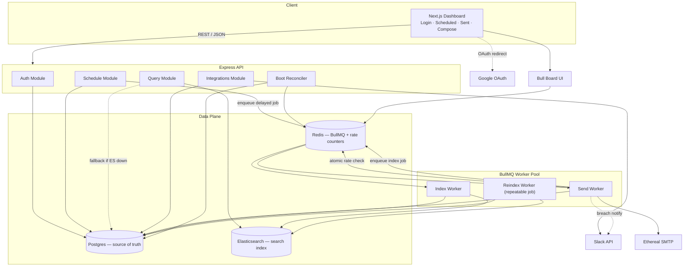
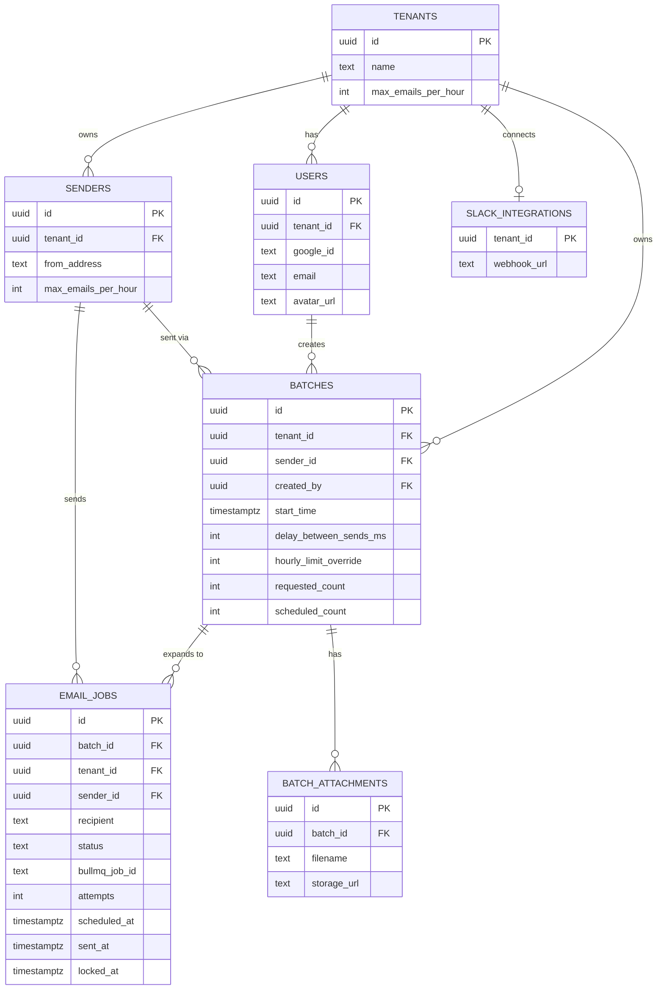
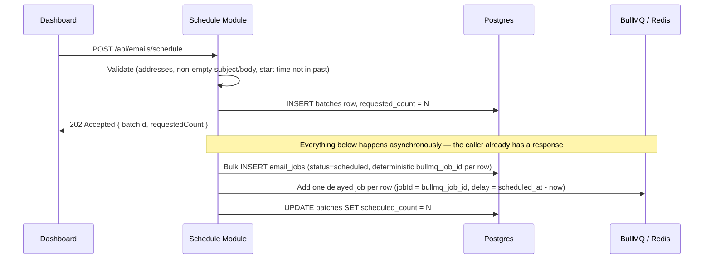
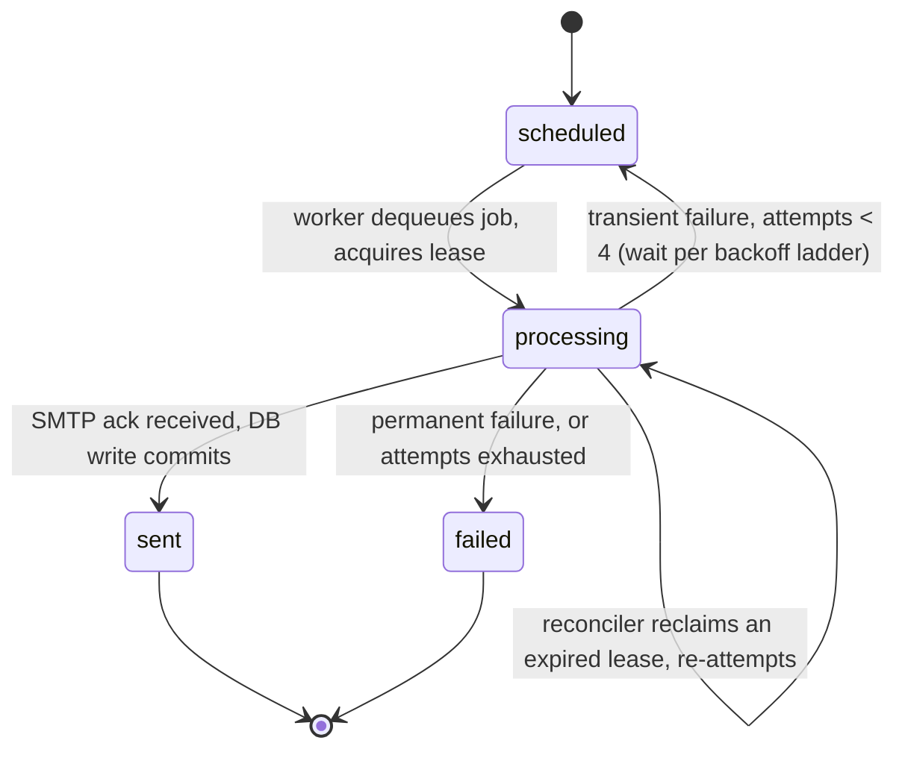
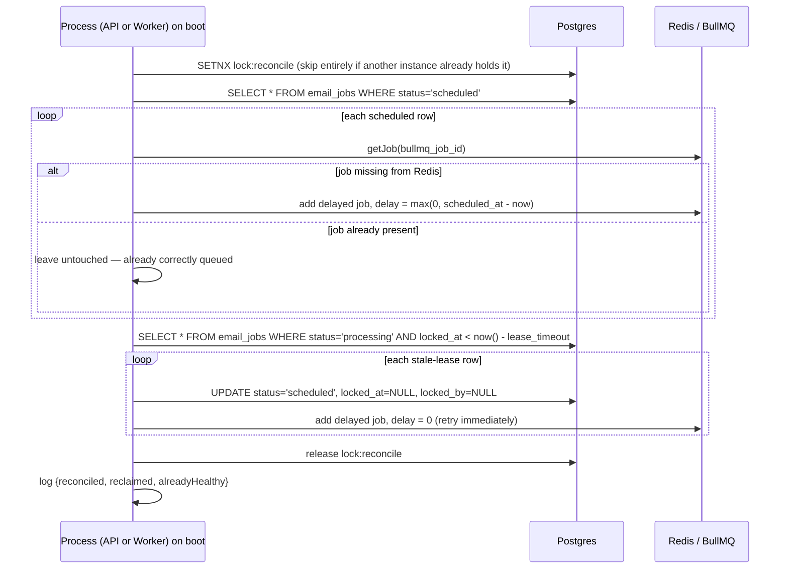

# Technical Design Document
## Email Job Scheduler & Dashboard

| | |
|---|---|
| **Product** | Email Job Scheduler & Dashboard |
| **Team** | Outbox Labs — ReachInbox.ai |
| **Document type** | Engineering design document — companion to the PRD |
| **Source PRD** | *Email Job Scheduler & Dashboard*, v1.0, September 9, 2026 |
| **Status** | Draft — Ready for Engineering Review |
| **Version** | 1.0 |
| **Last Updated** | September 9, 2026 |

---

### Table of Contents

0. [Purpose of This Document](#0-purpose-of-this-document)
1. [Resolved Open Questions](#1-resolved-open-questions)
2. [Architecture Overview](#2-architecture-overview)
3. [Tech Stack](#3-tech-stack)
4. [Data Model and Schema](#4-data-model-and-schema)
5. [Redis and Queue Design](#5-redis-and-queue-design)
6. [Core Flows and Algorithms](#6-core-flows-and-algorithms)
   - 6.1 Idempotent Batch Scheduling
   - 6.2 Send Worker State Machine
   - 6.3 Dual Rate Limiting — Per-Sender and Per-Tenant
   - 6.4 Retry and Backoff for Transient SMTP Failures
   - 6.5 Restart Reconciliation and Crash Recovery
   - 6.6 Rate-Limit Deferral
7. [Elasticsearch Design](#7-elasticsearch-design)
8. [API Contracts](#8-api-contracts)
9. [Frontend Architecture](#9-frontend-architecture)
10. [Slack Integration Design](#10-slack-integration-design)
11. [Security Considerations](#11-security-considerations)
12. [Observability and Logging](#12-observability-and-logging)
13. [Deployment Topology](#13-deployment-topology)
14. [Testing Strategy](#14-testing-strategy)
15. [Environment Variables Reference](#15-environment-variables-reference)
16. [Traceability Matrix](#16-traceability-matrix)

---

## 0. Purpose of This Document

The PRD defines **what** the Email Job Scheduler must do and **why** — the problem, the guarantees, the functional requirements (FR-1 through FR-33), and the risks. This document defines **how**: the concrete schema, algorithms, contracts, and component boundaries an engineer would build against.

It picks up from PRD §10 onward — deepening the architecture, resolving the four open questions from PRD §17, and adding the layers a PRD intentionally leaves at "high level": exact table schemas, lock/lease semantics, the rate limiter's atomic script, the retry ladder, and the frontend's component structure. Since the Figma reference never arrived, the seven provided screenshots now serve as that visual source of truth.

Every design decision below is cross-referenced to the FR(s) it satisfies. Section 16 is a lookup table from PRD subsection to design section, for reading this doc alongside the PRD during implementation or review.

---

## 1. Resolved Open Questions

PRD §17 left four questions open. Each is answered below with its concrete design consequence.

| # | PRD Question | Decision | Designed in |
|---|---|---|---|
| Q1 | Figma file referenced but no link attached — where should the design be sourced from? | No Figma. The **seven provided screenshots** (login; homepage/Scheduled; Sent; email detail; Compose + Send Later; Compose + Upload List; Compose + recipient chips) are the authoritative visual and behavioral reference for this phase. FR-29's "matching the provided Figma as closely as possible" is read as "matching the provided screenshots." | §9 |
| Q2 | Should the hourly rate limit be per-sender, per-tenant, or both? | **Both, simultaneously and atomically.** A send is allowed only if it's within cap for *both* its sender and its tenant in the current hour window; if either is exhausted, the job defers. | §6.3 |
| Q3 | Does Elasticsearch power Scheduled/Sent directly, or sit alongside the DB? | **Alongside.** Postgres stays the single source of truth for job existence and status (FR-9). Elasticsearch is a dual-written search/index layer the Query Module reads from for speed, with a same-request fallback to Postgres if ES is unavailable. | §7 |
| Q4 | What retry count and backoff curve for transient SMTP failures? | **4 total attempts**, exponential backoff **30s → 60s → 120s** between attempts, **± jitter**, retries applying **only to transient failures** — permanent failures (hard bounces, invalid recipients) go straight to `failed`. | §6.4 |

### 1.1 Additional gaps surfaced while reconciling the PRD against the screenshots

Cross-checking the FRs against the seven screenshots line-by-line surfaced three places where the visual reference implies more than the FRs state. None of these are contradictions — a static PRD wouldn't capture every UI state — so this design treats them as in-scope and flags them for a quick product confirm rather than silently picking a side.

| Gap | Screenshots show | FRs say | Resolution taken here |
|---|---|---|---|
| Attachments | A paperclip action in Compose; rendered image-attachment cards in Compose and in the email detail view | FR-30 lists subject, body, recipients, start time, delay, hourly limit — no mention of attachments | Treated as in-scope. Data model, API contract, and Compose component all include attachment support (§4, §8, §9). |
| Login form | A full email/password form beneath "Login with Google" | FR-1–FR-3 specify Google OAuth only ("no mocked auth"); no password-auth requirement anywhere in the PRD | Google OAuth is the only *functional* path. The email/password fields are rendered for visual fidelity to the screenshot but disabled in this phase — building a full credential-auth system isn't asked for by any FR (§9). |
| Email detail view | A full read view (back nav; star/archive/delete; sender meta; formatted body; attachment cards) reachable from a list row | FR-31/FR-32 specify list columns only, not a detail view | Included as a route (§9). Note: the sample content in that screenshot — "Amanda Clark" pitching tennis coaching, addressed *to* Oliver — reads as generic mock-generator placeholder copy rather than a real outbound campaign email. The **layout** is taken as spec; the **copy** is not — the detail view should render *our* scheduled/sent emails, sender = the workspace user, recipient = the batch contact. |

---

## 2. Architecture Overview



**Design principle carried forward from the PRD:** Postgres is the durable record of intent and outcome; Redis/BullMQ is the durable mechanism for making it happen on time; Elasticsearch is a read-optimization, never a dependency the send path needs to stay healthy.

**What's new versus the PRD's diagram:** the API is split into four logical modules instead of one block; the Elasticsearch write is moved off the request/send hot path into its own Index Worker (§7); and the periodic drift-correction job is explicitly a BullMQ *repeatable* job, not cron — this matters because FR-7 prohibits cron anywhere in the system, and a periodic reindex is exactly the kind of job that's tempting to implement with `node-cron`.

### 2.1 Component Responsibilities

| Component | Responsibility | Talks to |
|---|---|---|
| Auth Module | Google OAuth handshake, session issuance, `GET /api/me` | Google, Postgres |
| Schedule Module | Validate schedule requests, persist batch + jobs, enqueue delayed BullMQ jobs (FR-4–FR-9) | Postgres, Redis |
| Query Module | Serve Scheduled/Sent list and search (FR-27, FR-28, FR-31, FR-32) | Elasticsearch (primary), Postgres (fallback) |
| Integrations Module | Slack OAuth connect/disconnect, token storage (FR-22, FR-25) | Slack, Postgres |
| Boot Reconciler | On every process start, diff DB `scheduled` / stale-`processing` rows against Redis and repair (FR-10, FR-11) | Postgres, Redis |
| Send Worker | Dequeue jobs, enforce the dual rate limit, send via SMTP, transition status, trigger indexing (FR-12–FR-21) | Redis, Postgres, Ethereal, Slack |
| Index Worker | Consume "index this job" events, write to Elasticsearch, retry on failure (FR-27) | Redis, Postgres, Elasticsearch |
| Reindex Worker | Periodic (BullMQ repeatable, not cron) drift correction between DB and ES | Postgres, Elasticsearch |
| Bull Board | Live view of waiting/active/delayed/completed/failed jobs (FR-26) | Redis |


---

## 3. Tech Stack

| Layer | Choice | Notes |
|---|---|---|
| Frontend | Next.js (App Router, TypeScript), Tailwind CSS | Matches the clean, whitespace-heavy look of the screenshots; App Router gives clean route separation for `/login`, `/`, `/compose`, `/emails/[id]` |
| API | Express (TypeScript) | Per PRD §10 diagram; kept thin, business logic lives in the four modules from §2.1 |
| Validation | Zod | Schema-validates every request body against FR-5's "actionable errors" requirement |
| Scheduling | BullMQ | Delayed jobs, deterministic `jobId`, repeatable jobs for the reindex worker (FR-7, FR-8) |
| Queue/cache/rate-limit store | Redis (`ioredis` client) | AOF persistence enabled (see Risks, PRD §15) |
| Relational DB | Postgres (14+) | Chosen over MySQL for native `UUID`/`gen_random_uuid()`, partial indexes, and `SELECT … FOR UPDATE SKIP LOCKED` used in §6.5; the schema below is portable to MySQL with minor syntax changes if the team prefers |
| Search | Elasticsearch 8.x | Dual-written index, described in §7 |
| Mail transport | Nodemailer, pointed at Ethereal SMTP | Ethereal per FR-13; transport is an injected interface so swapping to SES/SendGrid later touches one module, not the worker logic (NFR — Maintainability) |
| Auth | `passport-google-oauth20` (or equivalent), server-side session (signed, httpOnly cookie) | No client-side token handling — ties to the Security NFR |
| Slack | `@slack/oauth`, `@slack/web-api` | OAuth v2 connect flow + `chat.postMessage` / incoming webhook for the breach notification |
| Live dashboard | `@bull-board/express` mounted at `/admin/queues` | FR-26 |
| Logging | Pino (structured JSON logs) | One log line per job-lifecycle transition, per the Observability NFR |
| Containerization | Docker Compose for local dev (API, worker, Postgres, Redis, Elasticsearch) | Matches "no manual intervention" restart story — `docker compose up` should reproduce full restart-safety locally |

---

## 4. Data Model and Schema



### 4.1 DDL (Postgres)

```sql
CREATE EXTENSION IF NOT EXISTS pgcrypto; -- for gen_random_uuid()

CREATE TABLE tenants (
  id                    UUID PRIMARY KEY DEFAULT gen_random_uuid(),
  name                  TEXT NOT NULL,
  max_emails_per_hour   INT NOT NULL DEFAULT 500, -- tenant-wide cap; overrides MAX_EMAILS_PER_HOUR env default
  created_at            TIMESTAMPTZ NOT NULL DEFAULT now()
);

CREATE TABLE users (
  id            UUID PRIMARY KEY DEFAULT gen_random_uuid(),
  tenant_id     UUID NOT NULL REFERENCES tenants(id),
  google_id     TEXT NOT NULL UNIQUE,
  name          TEXT NOT NULL,
  email         TEXT NOT NULL,
  avatar_url    TEXT,
  created_at    TIMESTAMPTZ NOT NULL DEFAULT now()
);

CREATE TABLE senders (
  id                    UUID PRIMARY KEY DEFAULT gen_random_uuid(),
  tenant_id             UUID NOT NULL REFERENCES tenants(id),
  name                  TEXT NOT NULL,
  from_address          TEXT NOT NULL,
  smtp_host             TEXT NOT NULL,
  smtp_port             INT NOT NULL,
  smtp_user             TEXT NOT NULL,
  smtp_pass_encrypted   TEXT NOT NULL,          -- app-level AES-GCM, never plaintext (see §11)
  max_emails_per_hour   INT NOT NULL DEFAULT 100, -- per-sender cap; overrides MAX_EMAILS_PER_HOUR_PER_SENDER env default
  created_at            TIMESTAMPTZ NOT NULL DEFAULT now(),
  UNIQUE (tenant_id, from_address)
);

CREATE TABLE batches (
  id                        UUID PRIMARY KEY DEFAULT gen_random_uuid(),
  tenant_id                 UUID NOT NULL REFERENCES tenants(id),
  created_by                UUID NOT NULL REFERENCES users(id),
  sender_id                 UUID NOT NULL REFERENCES senders(id),
  subject                   TEXT NOT NULL,
  body                      TEXT NOT NULL,
  start_time                TIMESTAMPTZ NOT NULL,
  delay_between_sends_ms    INT NOT NULL DEFAULT 0,
  hourly_limit_override     INT,                -- optional per-batch cap; falls back to sender/tenant defaults
  requested_count           INT NOT NULL,
  scheduled_count           INT NOT NULL DEFAULT 0, -- filled in as async expansion completes (FR-6)
  created_at                TIMESTAMPTZ NOT NULL DEFAULT now(),
  CHECK (start_time >= created_at - interval '1 minute') -- guards FR-5's "start time not in the past"
);

CREATE TABLE batch_attachments (
  id              UUID PRIMARY KEY DEFAULT gen_random_uuid(),
  batch_id        UUID NOT NULL REFERENCES batches(id) ON DELETE CASCADE,
  filename        TEXT NOT NULL,
  content_type    TEXT NOT NULL,
  size_bytes      BIGINT NOT NULL,
  storage_url     TEXT NOT NULL,     -- S3-compatible object storage
  created_at      TIMESTAMPTZ NOT NULL DEFAULT now()
);

CREATE TABLE email_jobs (
  id                UUID PRIMARY KEY DEFAULT gen_random_uuid(),
  batch_id          UUID NOT NULL REFERENCES batches(id),
  tenant_id         UUID NOT NULL REFERENCES tenants(id), -- denormalized: hot-path rate checks & tenant-scoped queries avoid a join
  sender_id         UUID NOT NULL REFERENCES senders(id),
  recipient         TEXT NOT NULL,
  status            TEXT NOT NULL DEFAULT 'scheduled'
                      CHECK (status IN ('scheduled', 'processing', 'sent', 'failed')), -- exact enum from PRD §11
  bullmq_job_id     TEXT NOT NULL UNIQUE,     -- deterministic: derived from (batch_id, recipient) — see §5
  attempts          INT NOT NULL DEFAULT 0,   -- mirrors BullMQ's attemptsMade for dashboard visibility (§6.4)
  last_error        TEXT,
  locked_at         TIMESTAMPTZ,              -- processing-lease start; NULL unless status = processing
  locked_by         TEXT,                     -- worker instance id holding the lease
  scheduled_at      TIMESTAMPTZ NOT NULL,
  sent_at           TIMESTAMPTZ,
  created_at        TIMESTAMPTZ NOT NULL DEFAULT now(),
  updated_at        TIMESTAMPTZ NOT NULL DEFAULT now()
);

-- One row per (batch, recipient): app-level idempotency backstop in addition to BullMQ's own jobId dedup (FR-8, FR-12)
CREATE UNIQUE INDEX idx_email_jobs_batch_recipient ON email_jobs (batch_id, recipient);

-- Dashboard list queries (Scheduled/Sent) and the reconciler's boot-time scan
CREATE INDEX idx_email_jobs_status_scheduled_at ON email_jobs (status, scheduled_at);
CREATE INDEX idx_email_jobs_tenant_status ON email_jobs (tenant_id, status);
CREATE INDEX idx_email_jobs_sender_status ON email_jobs (sender_id, status);

-- Fast lookup of leases the reconciler needs to reclaim (§6.5)
CREATE INDEX idx_email_jobs_processing_locked_at ON email_jobs (locked_at) WHERE status = 'processing';

CREATE TABLE slack_integrations (
  tenant_id                 UUID PRIMARY KEY REFERENCES tenants(id),
  access_token_encrypted    TEXT,
  webhook_url               TEXT,
  connected_by              UUID REFERENCES users(id),
  connected_at              TIMESTAMPTZ NOT NULL DEFAULT now()
);
-- Absence of a row for a tenant means "not connected" (FR-24) — no boolean flag needed.
```

### 4.2 Notes on key design choices

- **`status` is `TEXT` + `CHECK`, not a native `ENUM`.** Postgres enums require a type-altering migration to extend; a check constraint is a one-line migration if a future status (e.g. `cancelled`) is ever needed. The value set stays exactly the four states the PRD specifies — nothing added speculatively.
- **`tenant_id` is denormalized onto `email_jobs`** even though it's derivable via `batch_id → batches.tenant_id`. The dual rate limiter (§6.3) and the Scheduled/Sent queries both filter by tenant on the hot path; skipping the join is a direct lever on the PRD's p95 < 300ms dashboard target and the per-send rate-check latency.
- **The unique index on `(batch_id, recipient)`** is a second, independent idempotency guard beneath BullMQ's deterministic `jobId`. If the Schedule Module's async expansion (§6.1) is ever re-triggered for the same batch — a retried HTTP call, a redeployed worker picking up a half-finished expansion — the DB itself refuses the duplicate row, rather than relying solely on Redis being correct.
- **`locked_at` / `locked_by`** implement a lease, not a permanent claim. A worker crashing mid-send leaves a row parked in `processing`; without a lease timeout, that row would need a human to notice and fix it. §6.5 covers how the reconciler reclaims expired leases automatically.
- **Tenant creation** isn't specified anywhere in the PRD (billing/quota tiers and multi-user tenant invites are explicit non-goals). This design assumes a tenant is created automatically on first Google login — one tenant per first-login user for this phase — which keeps FR-1/FR-2 self-contained without inventing an onboarding flow the PRD never asked for. Flagged as an assumption, not a requirement.

---

## 5. Redis and Queue Design

| Key pattern | Purpose | TTL / lifecycle |
|---|---|---|
| `bull:email-send:*` | BullMQ's own queue state (waiting/active/delayed/completed/failed) for the `email-send` queue | Managed by BullMQ |
| `bull:reindex:*` | BullMQ repeatable-job state for the Reindex Worker (§7) | Managed by BullMQ |
| `rate:tenant:{tenantId}:{YYYYMMDDHH}` | Per-tenant hourly send counter | Expires at the top of the next hour + 5s buffer |
| `rate:sender:{senderId}:{YYYYMMDDHH}` | Per-sender hourly send counter | Expires at the top of the next hour + 5s buffer |
| `lock:reconcile` | Mutex so only one process instance runs boot reconciliation at a time | 60s, released on completion |

**Deterministic `jobId`:** `jobId = sha256(batchId + ":" + recipient.trim().toLowerCase()).slice(0, 32)`. This is what makes FR-8 real — re-adding a job with the same `batchId` + `recipient` (from a retried API call, a re-run reconciliation, or a redeployed worker re-processing a partially-expanded batch) resolves to the *same* BullMQ job. BullMQ itself treats `add()` with an existing, not-yet-removed `jobId` as a no-op returning the existing job, so double-enqueueing is safe by construction, not just by convention.

**Why AOF persistence, not just RDB snapshots:** RDB snapshots lose everything since the last snapshot on a crash; AOF (append-only file, `appendfsync everysec` is a reasonable default) bounds the loss window to ~1 second. This is the first line of defense against Redis data loss (PRD §15 risk); DB-based reconciliation on boot (§6.5) is the second line, and is what makes the guarantee real even if AOF itself is disabled or corrupted.

---

## 6. Core Flows and Algorithms

### 6.1 Idempotent Batch Scheduling

Satisfies FR-4, FR-5, FR-6, FR-8. The API must never block on inserting a large batch (FR-6), so batch creation and job expansion are split into a fast synchronous step and an async fan-out.



Each row's `scheduled_at` is derived from `start_time + (row_index * delay_between_sends_ms)`, giving the "natural pacing" the PRD's background section calls out — even before the hourly cap ever engages, sends are already spread out rather than fired in a burst.

Because `bullmq_job_id` is computed the same way every time (§5), re-running this expansion for the same batch — say, a worker crash mid-fan-out followed by a resumed job — is safe: the DB insert either succeeds (new row) or is rejected by the `(batch_id, recipient)` unique index (already exists, skip), and the BullMQ `add()` call either creates the delayed job or silently matches the existing one.

### 6.2 Send Worker State Machine

Satisfies FR-12. `processing` is the only state a crash can leave a job stranded in — the diagram below is intentionally explicit about that, since it's the state the reconciler (§6.5) has to reason about.



Before flipping a row to `processing`, the worker re-reads its DB status inside the same transaction. If it's already `sent` — the classic redelivery case, where BullMQ or the reconciler hands the worker a job that was actually already completed — the worker acks and no-ops instead of sending again. This is the concrete mechanism behind FR-12's "a crash mid-send can never cause a silent double-send on retry."

### 6.3 Dual Rate Limiting — Per-Sender and Per-Tenant

Resolves Open Q2. Satisfies FR-19, FR-20, FR-21. A send has to clear *two* independent hourly caps — its sender's and its tenant's — and the check against both has to be atomic across concurrently-running workers, or two workers racing the same boundary could both read "one slot left" and both send, breaching the cap (PRD Key Edge Case: "Two workers hit the hourly cap boundary simultaneously").

Redis Lua scripts execute atomically (Redis is single-threaded per script), so the check-and-increment for both counters happens as one indivisible operation:

```lua
-- KEYS[1] = tenant rate key   e.g. rate:tenant:{tenantId}:{hourWindow}
-- KEYS[2] = sender rate key   e.g. rate:sender:{senderId}:{hourWindow}
-- ARGV[1] = tenant cap (tenants.max_emails_per_hour, or MAX_EMAILS_PER_HOUR env default)
-- ARGV[2] = sender cap (senders.max_emails_per_hour, or MAX_EMAILS_PER_HOUR_PER_SENDER env default)
-- ARGV[3] = seconds until the hour window boundary (TTL for both keys)

local tenantCount = tonumber(redis.call('GET', KEYS[1]) or '0')
local senderCount  = tonumber(redis.call('GET', KEYS[2]) or '0')

if tenantCount >= tonumber(ARGV[1]) or senderCount >= tonumber(ARGV[2]) then
  return 0 -- reject: caller defers the job (§6.6)
end

redis.call('INCR', KEYS[1])
redis.call('EXPIRE', KEYS[1], ARGV[3])
redis.call('INCR', KEYS[2])
redis.call('EXPIRE', KEYS[2], ARGV[3])
return 1 -- allow: caller proceeds to SMTP send
```

Rejecting *before* incrementing either counter means a denied attempt never partially consumes tenant quota without consuming sender quota (or vice versa) — the two counters move together or not at all. Caps themselves are read from `senders.max_emails_per_hour` / `tenants.max_emails_per_hour` (falling back to the `MAX_EMAILS_PER_HOUR*` env defaults when the DB column is null), giving workspace admins real per-sender and per-tenant configurability without a redeploy — the concrete answer to the "Workspace admins... rate-limit configuration" need in PRD §4.

### 6.4 Retry and Backoff for Transient SMTP Failures

Resolves Open Q4. Satisfies FR-15. Four total attempts; the wait is exponential with jitter; only transient failures consume the ladder.

| Attempt | Trigger | Wait before this attempt | Cumulative elapsed |
|---|---|---|---|
| 1 | Job becomes due | 0s | 0s |
| 2 | Attempt 1 failed (transient) | ~30s ± jitter | ~30s |
| 3 | Attempt 2 failed (transient) | ~60s ± jitter | ~90s |
| 4 | Attempt 3 failed (transient) | ~120s ± jitter | ~210s |
| — | Attempt 4 failed (transient) | — | Status → `failed`, reason = "max attempts exceeded" |

Jitter is ±20% of the base delay (`delay = base + base * 0.2 * (2 * random() - 1)`), which spreads out a batch of jobs that all failed at the same instant — e.g. a brief Ethereal outage — instead of them all retrying in lockstep and re-hammering the same failure.

```js
// BullMQ custom backoff strategy, registered on the email-send queue
function backoffStrategy(attemptsMade) {
  const table = [30_000, 60_000, 120_000]; // ms
  const base = table[Math.min(attemptsMade - 1, table.length - 1)];
  const jitter = base * 0.2 * (Math.random() * 2 - 1); // +/- 20%
  return Math.max(0, Math.round(base + jitter));
}
// Queue registration: { attempts: 4, backoff: { type: 'custom' } }
```

Classifying a failure as transient or permanent decides whether it ever reaches that ladder:

| Classification | Examples | Worker behavior |
|---|---|---|
| Transient | Connection timeout/reset, `421` (service unavailable), `450`/`451`/`452` (mailbox busy, local error, insufficient storage) | Increment `attempts`, status back to `scheduled`, let BullMQ's backoff schedule the retry |
| Permanent | `550`/`551`/`553`/`554` (mailbox unavailable, user unknown, exceeded quota, transaction failed), address failed validation | Status → `failed` immediately, `job.discard()` so BullMQ doesn't burn a retry on something that will never succeed |

`email_jobs.attempts` is a DB mirror of BullMQ's own internal `attemptsMade` — deliberately duplicated, not the single source of truth. BullMQ's counter drives the actual retry logic (it's what the backoff function reads); the DB copy exists so the Sent/Scheduled dashboard and an on-call engineer can see retry history by querying Postgres, without reaching into Redis internals. This mirrors the PRD's own DB-truth / Redis-mechanism split, just at a smaller scale.

### 6.5 Restart Reconciliation and Crash Recovery

Satisfies FR-9, FR-10, FR-11. Elaborates the PRD §10.1 sequence diagram with the one case it names but doesn't fully resolve: a job stuck in `processing` because its worker died mid-send.



Two passes, two different failure modes:

1. **`scheduled` rows missing from Redis** — the case the PRD's diagram already shows: Redis lost data, or the job was never successfully enqueued in the first place. Deterministic `jobId` means re-adding is always safe, whether or not the job secretly still existed.
2. **`processing` rows with an expired lease** — a worker died between marking a row `processing` and confirming `sent`. A short, generous lease timeout (e.g. 5 minutes — long enough that a live worker's genuine in-flight SMTP call won't be mistaken for dead) distinguishes "still being handled by a live worker" from "orphaned by a crash." Only expired leases get reclaimed; a fresh lease is left alone even though the row is sitting in `processing`, because another instance may legitimately still be mid-send.

**A residual risk worth naming rather than hiding:** if a worker crashes in the narrow window *after* Ethereal acknowledges the send but *before* the `sent` write commits, reconciliation will correctly see an expired lease and retry — sending a second, genuinely duplicate email. Nothing in this design (or, for what it's worth, in most at-least-once delivery systems without an idempotent downstream) closes that window to zero, because Ethereal has no idempotency-key concept to lean on. The mitigation is making the window as small as possible — the `sent` write is the very next statement after the SMTP call returns, with nothing else in between — and accepting the residual risk for this phase, the same way the PRD accepts Ethereal-over-SES as a phase-appropriate trade-off. A future move to a provider with idempotent send APIs (e.g. an idempotency key SES/SendGrid can dedupe on) would close this properly.

### 6.6 Rate-Limit Deferral

Satisfies FR-21. When §6.3's Lua script returns "reject," the job is deferred, never failed:

- `email_jobs.scheduled_at` is updated to the start of the next hour window.
- Status stays `scheduled` — deferral isn't a failure, so `attempts` is **not** incremented and no `last_error` is recorded.
- The BullMQ job is re-added with a delay matching the new `scheduled_at`.
- If Slack is connected, the breach is reported (§10) — fire-and-forget, off the send path, per FR-24.

This deliberately doesn't try to look further ahead than "the next hour" — if that hour is also projected to be full given queue volume, the same worker will hit the same deferral logic again when the job becomes due a second time. That keeps the mechanism simple and self-correcting rather than building a capacity-forecasting scheduler the PRD never asked for; the natural backpressure loop is the point.

---

## 7. Elasticsearch Design

Resolves Open Q3. Postgres is where a job's existence and status are decided; Elasticsearch only makes that decided state searchable, faster than Postgres alone would for free-text/multi-field queries at scale. Nothing about correctness depends on ES being up.

### 7.1 Index mapping

```json
{
  "mappings": {
    "properties": {
      "id":          { "type": "keyword" },
      "batchId":     { "type": "keyword" },
      "tenantId":    { "type": "keyword" },
      "senderId":    { "type": "keyword" },
      "senderEmail": { "type": "keyword" },
      "recipient":   { "type": "text", "fields": { "raw": { "type": "keyword" } } },
      "subject":     { "type": "text" },
      "status":      { "type": "keyword" },
      "scheduledAt": { "type": "date" },
      "sentAt":      { "type": "date" },
      "createdAt":   { "type": "date" },
      "error":       { "type": "text" }
    }
  }
}
```

`recipient` gets both a `text` field (for partial/analyzed matching) and a `.raw` `keyword` sub-field (for exact filters and sorting) — the same pattern applied consistently wherever a field needs both.

### 7.2 Dual-write, decoupled from the send path

Every DB write to `email_jobs` that changes status (insert on schedule, update on send/fail/defer) enqueues a small `index-email` job — `{ emailJobId }`, nothing heavier — onto its own BullMQ queue, consumed by the Index Worker. That worker reads the current row from Postgres and upserts it into ES by `id`, which makes the write idempotent: replaying the same index job twice (a retried job, a redelivered one) just overwrites with the same data.

This is deliberately **not** inline in the Send Worker's hot path. A slow or momentarily-unavailable Elasticsearch cluster should never add latency to sending an email or deciding its status — it can only ever add latency to *finding* that email in a search result a few seconds later. If the index job itself fails, BullMQ's own retry (a simpler, short fixed backoff — ES hiccups are usually transient infrastructure blips, not the SMTP failure taxonomy of §6.4) handles it without any special-casing in the Send Worker.

### 7.3 Read-path fallback

The Query Module tries Elasticsearch first for `GET /api/emails/scheduled` and `GET /api/emails/sent`. On an ES error or timeout, it falls back to a direct Postgres query using the indexes from §4.1 (`idx_email_jobs_tenant_status`, plus a simple `ILIKE` on `recipient`/`subject` for the fallback's search term) rather than surfacing an error to the dashboard. This is the concrete answer to the PRD's own risk entry, "Elasticsearch/DB drift" — the two never being allowed to disagree in a way the user can see, because the user-facing read always has a path back to the source of truth.

### 7.4 Reindex Worker — drift correction

A periodic full or partial reindex is exactly the kind of job it'd be easy to reach for `node-cron` on — and exactly what FR-7 prohibits. Instead it runs as a **BullMQ repeatable job** (e.g. every 15 minutes): still Redis-backed, still going through the same worker infrastructure as everything else, satisfying "no cron, anywhere" while still being periodic. It compares recently-updated DB rows (by `updated_at`) against their ES counterparts and re-indexes anything that's missing or stale — a second line of defense under the dual-write in §7.2, the same "belt and suspenders" pattern as the reconciler in §6.5. A manual full-reindex trigger (an admin-only endpoint) is also worth exposing for the rare case of standing up a new ES cluster or recovering from a larger drift.

### 7.5 Example query — Scheduled view, filtered and paginated

```json
{
  "query": {
    "bool": {
      "filter": [
        { "term": { "tenantId": "<tenantId>" } },
        { "term": { "status": "scheduled" } },
        { "range": { "scheduledAt": { "gte": "<from>", "lte": "<to>" } } }
      ],
      "must": [
        { "multi_match": { "query": "<searchTerm>", "fields": ["subject", "recipient"] } }
      ]
    }
  },
  "sort": [{ "scheduledAt": "asc" }],
  "from": 0,
  "size": 25
}
```

`tenantId` is always a mandatory filter, never optional — it comes from the authenticated session server-side, never from a client-supplied parameter (see §11).

---

## 8. API Contracts

All responses share one error envelope:

```json
{ "error": { "code": "VALIDATION_ERROR", "message": "recipient[3] is not a valid email address", "details": {} } }
```

### `POST /api/emails/schedule`

```json
// Request
{
  "senderId": "uuid",
  "subject": "string",
  "body": "string (HTML)",
  "recipients": ["a@example.com", "b@example.com"],
  "recipientListUploadId": "uuid | null",
  "startTime": "2026-09-10T10:00:00Z",
  "delayBetweenSendsMs": 3000,
  "hourlyLimit": 50,
  "attachments": [{ "filename": "brochure.pdf", "storageUrl": "https://..." }]
}

// Response — 202 Accepted
{
  "batchId": "uuid",
  "requestedCount": 214,
  "invalidCount": 3,
  "invalidSamples": ["not-an-email"]
}
```

`recipients` and `recipientListUploadId` are mutually exclusive — direct entry (the chip-input screenshot) or an uploaded CSV/text list (the "Upload List" screenshot), never both. `invalidCount`/`invalidSamples` in the response is the "parsed-count feedback" FR-30 asks for — surfaced here rather than as a separate endpoint, so Compose can show it the moment scheduling completes rather than in a second round-trip. `attachments` is the addition flagged in §1.1.

### `GET /api/emails/scheduled` and `GET /api/emails/sent`

```
GET /api/emails/scheduled?q=&status=&from=&to=&page=1&pageSize=25
```

```json
{
  "items": [
    {
      "id": "uuid",
      "recipient": "john@example.com",
      "subject": "Meeting follow-up",
      "status": "scheduled",
      "scheduledAt": "2026-09-10T09:15:12Z",
      "sentAt": null
    }
  ],
  "page": 1,
  "pageSize": 25,
  "total": 12
}
```

Same shape for `/sent`, with `status` constrained to `sent | failed` and `sentAt` populated.

### `GET /api/me`

```json
{ "id": "uuid", "name": "Oliver Brown", "email": "oliver.brown@domain.io", "avatarUrl": "https://..." }
```

### `POST /api/integrations/slack/connect` / `GET /api/integrations/slack/callback` / `DELETE /api/integrations/slack`

Standard OAuth v2 redirect-and-callback pair, detailed in §10; `DELETE` clears the `slack_integrations` row for the tenant (FR-24's "not connected" state).

---

## 9. Frontend Architecture

Per Open Q1 (§1), the seven screenshots are the design spec. This section maps each one to a route and component set.

### 9.1 Routes

| Route | Screenshot(s) | Purpose |
|---|---|---|
| `/login` | 1 | Google OAuth entry point |
| `/` (tab state: `scheduled` \| `sent`) | 2, 3 | Dashboard shell — list view for whichever tab is active |
| `/emails/[id]` | 4 | Read-only detail view for a single email |
| `/compose` | 5, 6, 7 | New batch composition |

### 9.2 Screen-by-screen notes

| Screenshot | What it shows | Build notes |
|---|---|---|
| 1 — Login | "Login with Google" (primary), a divider, then email/password fields, then a solid "Login" button | Only the Google button is wired to a real handler (FR-1). The email/password fields render for visual parity but are `disabled` with no submit handler — see §1.1's gap analysis for why. |
| 2 — Homepage / Scheduled | Sidebar: wordmark, user card with avatar/name/email, "Compose" CTA, `Scheduled` (active, count 12) and `Sent` (count 785) nav items. Main pane: search bar with filter and refresh icons, a list of rows (`To: <name>`, an amber time pill, bold subject + gray preview, a star toggle) | The nav counts are live aggregates (`COUNT(*) WHERE status='scheduled'` / `sent`), not hardcoded — refetched whenever a job transitions, ideally via the same query that renders the badge so it never drifts from the list beneath it. |
| 3 — Sent | Same list layout, `Sent` tab active, pill reads "Sent" instead of a timestamp | FR-32 also requires a `failed` status to be shown here — not present in this screenshot's sample data, but the pill component needs a third visual state for it (see §9.4). |
| 4 — Email detail | Back nav; star/archive/delete actions; sender avatar, name, email, "to me," date; formatted body with a callout block, bold text, a sign-off, and two image-attachment cards (thumbnail, filename, size) | As noted in §1.1, the sample content here is placeholder copy from whatever generated the mock, not a real campaign email — build the *layout*, not that copy. This is the same body-renderer and attachment-card component Compose uses to show what's already been attached (5, 6, 7 below), just read-only. |
| 5 — Compose, default state | Header: back nav, title, paperclip/clock icons, solid "Send" button. Fields: `From` (sender dropdown), `To`, `Subject`, `Delay between 2 emails` + `Hourly Limit` (two numeric inputs), a rich-text body with a full formatting toolbar. The clock icon opens a "Send Later" popover: a date/time picker plus four quick presets (Tomorrow; Tomorrow 10:00 AM; Tomorrow 11:00 AM; Tomorrow 3:00 PM) and Cancel/Done | The two numeric fields are unlabeled beyond their placeholder "00" — this design treats them as seconds (human-scale for "delay between sends") and maps them to `delayBetweenSendsMs = value * 1000` client-side before hitting the API contract in §8; worth a one-line unit label in implementation even though the mock doesn't show one. |
| 6 — Compose, after picking Send Later + attaching | Paperclip and clock icons now show active (green) state; the primary CTA has swapped from solid "Send" to outlined "Send Later" — reflecting that a time's been chosen; a new "Upload List" action (green, up-arrow icon) appears beside `To`; an attached image renders as a thumbnail beneath the editor | The Send/Send Later CTA swap is state-driven off whether `sendLaterTime` is set, not two separate buttons. |
| 7 — Compose, bulk recipients | `To` now holds removable chips (`tame@jmail.com`, `lame@jmail.com`, `dame@jmail.com`) plus a `+4` overflow chip (7 recipients total from an uploaded list) | This is the CSV/list-upload result: parsing happens on `Upload List`, chips render per parsed address, and the FR-30 "parsed-count feedback" surfaces as a small inline confirmation near the action (e.g. "7 added, 0 skipped") — implied by the chips but not itself pictured in a static screenshot. The blue border around the whole panel in this screenshot reads as the mock tool's own "selected element" highlight rather than a real UI treatment, and shouldn't be built. |

### 9.3 Component tree

```
AppShell
├── Sidebar
│   ├── Logo
│   ├── UserMenu            (avatar, name, email, dropdown → Logout)
│   ├── ComposeButton        → routes to /compose
│   └── NavList
│       ├── NavItem (Scheduled, count)
│       └── NavItem (Sent, count)
├── TopBar                   (SearchInput, FilterButton, RefreshButton)
├── EmailList                (used by / for both tabs)
│   └── EmailListRow × N     (recipient, StatusPill, subject + preview, StarToggle)
├── EmailDetail               (/emails/[id])
│   ├── DetailHeader          (back, star, archive, delete)
│   ├── SenderMeta            (avatar, name, email, date)
│   ├── BodyRenderer
│   └── AttachmentCard × N
└── ComposeForm               (/compose)
    ├── FromSelect
    ├── ToField                (ChipInput + UploadListAction)
    ├── SubjectInput
    ├── PacingInputs           (DelayInput, HourlyLimitInput)
    ├── RichTextEditor + Toolbar
    ├── AttachmentTray
    ├── SendLaterPopover        (DateTimePicker, PresetList, Cancel/Done)
    └── PrimaryCTA              (label: "Send" | "Send Later")
```

Every leaf here is its own typed component (props typed against the API contracts in §8), satisfying FR-33's componentization/DRY/type requirement directly rather than as an afterthought.

### 9.4 Data fetching, loading, empty, and error states

- List views (`EmailList`) fetch through the Query Module (§7.3) with `useSWR`/React Query keyed on `[tab, searchTerm, filters, page]`; a new row appears in Scheduled optimistically the moment `POST /api/emails/schedule` returns its `202` (using `requestedCount`), then reconciles against the real rows once async expansion finishes and the list re-fetches.
- **Loading** — skeleton rows matching the real row's shape (avatar-less placeholder, two shimmer bars), never a bare spinner, so the list doesn't visually jump when data arrives.
- **Empty** — Scheduled: "Nothing scheduled yet" with the Compose CTA restated inline; Sent: "Nothing sent yet." Both required explicitly by FR-31/FR-32.
- **Error** — a retry-affordant inline banner in the list pane, not a full-page failure — consistent with §7.3's principle that a backend hiccup should degrade, not break, the dashboard.
- **StatusPill** — three visual states are needed even though the screenshots only show two: `scheduled` (amber, clock icon, per screenshot 2), `sent` (neutral/gray, per screenshot 3), and `failed` (required by FR-32, not in the provided mocks — a red/error-toned pill is the natural third state, consistent with the amber/gray pair's saturation logic).

---

## 10. Slack Integration Design

Satisfies FR-22 through FR-25.

1. **Connect** — "Connect Slack" in the dashboard hits `POST /api/integrations/slack/connect`, which redirects into Slack's real OAuth v2 authorize URL (scopes limited to `chat:write` / incoming-webhook, whichever the notification mechanism needs — no broader scope than the one notification requires).
2. **Callback** — `GET /api/integrations/slack/callback` exchanges the code for a token/webhook URL and upserts the `slack_integrations` row for the current tenant.
3. **Notify** — inside the Send Worker's rate-limit-breach branch (§6.3/§6.6), a thin `notifySlack(tenantId, message)` helper:
   - Reads the tenant's token **at call time**, not at process-start — this is what makes FR-25 true ("connect Slack after some limit hits have already occurred… no redeploy"), since a token cached at boot would miss a mid-session connection.
   - If no row exists for the tenant, returns immediately — no error, no log noise (FR-24).
   - Wraps the actual Slack API call in try/catch; a failure (revoked token, Slack API downtime) is logged at `warn` level and swallowed, never thrown up into the send path (FR-24, and the PRD's own Risk: "Slack API downtime… failures never block the send pipeline").
4. **Disconnect** — `DELETE /api/integrations/slack` deletes the row; the very next breach check finds nothing and behaves exactly like "never connected."

---

## 11. Security Considerations

- **Secrets at rest** — `senders.smtp_pass_encrypted` and `slack_integrations.access_token_encrypted` are application-level AES-GCM encrypted columns (key from a KMS or environment secret, never the DB itself); nothing SMTP- or Slack-credential-shaped ever reaches the Next.js client bundle.
- **Sessions** — server-side session (signed, `httpOnly`, `secure`, `sameSite=lax` cookie) issued after the Google OAuth callback; no token handling in client JS, consistent with the PRD's Security NFR.
- **Tenant isolation** — every query in the Query, Schedule, and Integrations modules derives `tenantId` from the authenticated session server-side. It is never accepted as a client-supplied parameter, which is what makes the dual rate limiter in §6.3 trustworthy — a client can't claim a different tenant to dodge its cap.
- **Input validation** — every mutating endpoint validated with Zod before touching the DB (FR-5); malformed or duplicate recipient addresses are deduplicated and reported back rather than silently dropped or silently accepted (PRD Key Edge Case: "CSV contains duplicate or malformed addresses").
- **API-level throttling** — a lightweight per-IP/per-session rate limit on the API itself (e.g. `express-rate-limit`) is a good idea to prevent abuse of the schedule endpoint, distinct from and layered on top of the product's own per-sender/per-tenant email rate limiting.

---

## 12. Observability and Logging

Every job-lifecycle transition emits one structured (JSON) log line: `{ jobId, batchId, tenantId, senderId, fromStatus, toStatus, attempt, latencyMs, timestamp }`. This is the concrete shape behind the PRD's Observability NFR, and it's what lets each PRD §5 success metric actually be measured:

| PRD success metric | How it's measured from this design |
|---|---|
| Scheduled sends executed within ±30s of intended window | Compare `scheduled_at` to the transition log's timestamp for `→ processing` |
| Duplicate sends after crash/restart = 0 | Nightly check: `email_jobs` grouped by `(batch_id, recipient)` having `status='sent'` count > 1 — should always return zero rows, given §4.1's unique index |
| Jobs lost after crash/restart = 0 | Compare pre-restart `scheduled` count to post-reconciliation `scheduled + processing + sent + failed` count — should be equal |
| Rate-limit correctness under concurrent workers | Count log lines where `toStatus=sent` in a given hour window, grouped by sender/tenant — should never exceed the configured cap, by construction of §6.3's atomic script |
| Dashboard p95 < 300ms | Standard API latency histograms on the Query Module's endpoints |

Bull Board (`/admin/queues`, FR-26) remains the primary *live* operational view — the structured logs are for after-the-fact analysis and alerting, not a replacement for it.

---

## 13. Deployment Topology

Three deployable units, each independently scalable: the **API** (stateless, horizontally scalable behind a load balancer), the **Worker** (concurrency controlled entirely by `WORKER_CONCURRENCY`, per FR-16 — scale by running more instances, not by raising one instance's concurrency indefinitely), and the **Reindex Worker's repeatable job**, which can live inside the same worker process rather than as a fourth deployable. Postgres, Redis, and Elasticsearch are each a single instance for this phase, matching the PRD's explicit non-goal of multi-region/geo-distributed workers. Redis needs AOF persistence enabled at the infrastructure level (§5); Postgres and Elasticsearch need their standard backup/snapshot story, which this phase doesn't otherwise change. `docker-compose.yml` wiring all five (API, worker, Postgres, Redis, Elasticsearch) is the expected local-dev setup, so a developer can kill and restart the worker container mid-batch and watch reconciliation do its job — the best local proof of FR-10.

---

## 14. Testing Strategy

| Layer | What to test | How |
|---|---|---|
| Dual rate limiter | No breach under concurrency | Spin up N fake workers hammering the same sender+tenant pair in parallel past the cap; assert the sent count never exceeds either configured limit |
| Reconciliation | Restart-safety | Integration test: schedule a batch, `kill -9` the worker mid-send, restart, assert every job eventually reaches `sent` exactly once |
| Retry/backoff | Timing ladder is correct | Mock SMTP to fail transiently N times, assert retry timestamps land on the 30s/60s/120s (± jitter) ladder from §6.4 |
| Idempotency | Re-running is a no-op | POST the same schedule payload twice (simulating a retried client call); re-run the reconciler twice in a row; assert no duplicate `email_jobs` rows either time |
| Elasticsearch fallback | Dashboard survives ES being down | Point the Query Module at an unreachable ES host; assert `/api/emails/scheduled` still returns correct data from the Postgres fallback |
| Frontend | Loading/empty/error states render correctly for both tabs | Component tests against each `EmailList` state from §9.4, independent of a live backend |

---

## 15. Environment Variables Reference

Every limit in this design is environment-driven (FR-16, FR-18, FR-19) — nothing below is a hardcoded constant in application code.

| Variable | Purpose | Example |
|---|---|---|
| `DATABASE_URL` | Postgres connection string | `postgres://...` |
| `REDIS_URL` | Redis connection string | `redis://...` |
| `ELASTICSEARCH_URL` | Elasticsearch endpoint | `http://...:9200` |
| `WORKER_CONCURRENCY` | BullMQ worker concurrency (FR-16) | `10` |
| `MIN_DELAY_BETWEEN_SENDS_MS` | Default floor for delay-between-sends if a batch doesn't override it (FR-18) | `2000` |
| `MAX_EMAILS_PER_HOUR` | Tenant-wide hourly cap default (FR-19) | `500` |
| `MAX_EMAILS_PER_HOUR_PER_SENDER` | Per-sender hourly cap default (FR-19) | `100` |
| `RETRY_MAX_ATTEMPTS` | Total attempts before `failed` (§6.4) | `4` |
| `RETRY_BASE_DELAYS_MS` | Backoff ladder (§6.4) | `30000,60000,120000` |
| `RETRY_JITTER_PCT` | Jitter as a fraction of base delay | `0.2` |
| `RECONCILE_LEASE_TIMEOUT_MS` | How long a `processing` lease is honored before reclaim (§6.5) | `300000` |
| `GOOGLE_CLIENT_ID` / `GOOGLE_CLIENT_SECRET` / `GOOGLE_REDIRECT_URI` | Google OAuth app config | — |
| `SLACK_CLIENT_ID` / `SLACK_CLIENT_SECRET` / `SLACK_REDIRECT_URI` | Slack OAuth app config | — |
| `SESSION_SECRET` | Session cookie signing key | — |
| `ATTACHMENT_STORAGE_BUCKET` | Object storage bucket for `batch_attachments` | — |

---

## 16. Traceability Matrix

| PRD subsection | Design section(s) |
|---|---|
| 8.1 Authentication | §9.2 (Screen 1), §11 |
| 8.2 Email Scheduling API | §6.1, §8 |
| 8.3 Scheduling Engine (BullMQ + Redis) | §5, §6.1 |
| 8.4 Restart Persistence & Recovery | §6.2, §6.5 |
| 8.5 Sending | §3, §6.4 |
| 8.6 Concurrency | §6.3, §15 |
| 8.7 Delay Between Sends | §4.1 (`batches.delay_between_sends_ms`), §9.2 |
| 8.8 Hourly Rate Limiting | §6.3, §6.6 |
| 8.9 Slack Notifications | §10 |
| 8.10 Live Queue Dashboard | §2 (Bull Board), §12 |
| 8.11 Search (Elasticsearch) | §7 |
| 8.12 Frontend — Shell | §9.1, §9.3 |
| 8.13 Frontend — Compose | §8 (`schedule` contract), §9.2 (Screens 5–7) |
| 8.14 Frontend — Scheduled/Sent Views | §7.3, §9.4 |
| 8.15 Frontend Code Quality | §9.3 |
| §9 Non-Functional Requirements | §11 (Security), §12 (Observability), §13 (Deployment), §15 (Configurability) |
| §17 Open Questions (Q1–Q4) | §1 |

---

*This design document is derived from the ReachInbox "Full-stack Email Job Scheduler" PRD v1.0 and the seven UI reference screenshots provided in place of Figma. Section numbers in §1–§16 are independent of the PRD's own numbering; cross-references above use "PRD §N" explicitly wherever the two could be confused.*
