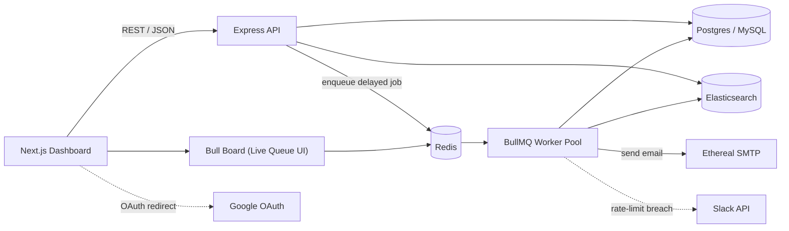
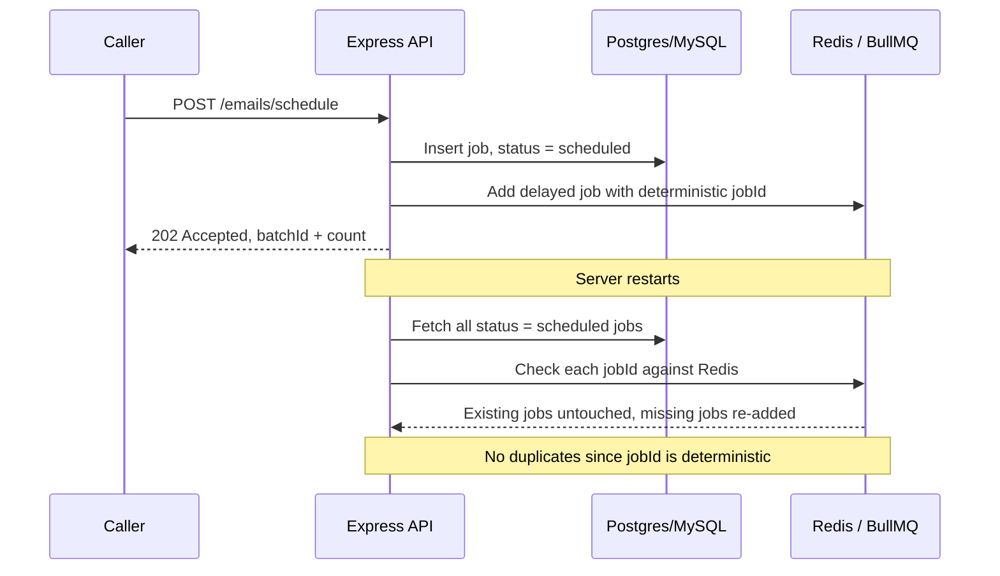

# Product Requirements Document
## Email Job Scheduler & Dashboard

| | |
|---|---|
| **Product** | Email Job Scheduler & Dashboard |
| **Team** | Outbox Labs — ReachInbox.ai |
| **Author** | *[Your name]* |
| **Status** | Draft — Ready for Engineering Review |
| **Version** | 1.0 |
| **Last Updated** | September 9, 2026 |

---

## 1. Overview

ReachInbox's product promise — "one prompt, and we prospect, verify, personalize, and send" — is only as strong as the infrastructure that gets an email out of the queue and into an inbox at exactly the right moment. This PRD defines the requirements for a **standalone scheduling and sending engine**: a backend service and companion dashboard that accepts email-send requests, schedules them precisely, throttles them like a real deliverability-conscious sender would, survives crashes and restarts without losing or duplicating work, and gives users and engineers live visibility into what's queued, sending, and sent.

This is foundational infrastructure, not a customer-facing campaign builder. It's the engine room every higher-level ReachInbox feature — sequences, drip campaigns, one-off blasts — will eventually sit on top of.

## 2. Background & Problem

Cold email at scale lives and dies on two things: **timing** and **restraint**.

- Send too many emails too fast from one sender and mailbox providers throttle or blacklist it.
- Lose track of what's already been sent after a crash, and you either double-send to a lead (reputation damage, spam complaints) or silently drop them (lost revenue for the customer).
- "Check every minute and send what's due" cron-style approaches don't hold up under scale: they don't cleanly persist mid-flight work, they race across multiple instances, and they have no natural backpressure when a rate limit is hit.

ReachInbox needs a scheduling core that treats **persistence, idempotency, and throttling as first-class concerns**, not features bolted on later — because the cost of getting this wrong is a customer's sender reputation.

## 3. Goals

### 3.1 Business Goals
- Establish a sending backbone reliable enough to underwrite ReachInbox's "set it and forget it" promise.
- Reduce the operational burden created by duplicate sends, silently dropped jobs, or invisible rate-limit failures.
- Build a foundation that scales to many senders and tenants without a rewrite when real SMTP providers replace Ethereal.

### 3.2 User Goals
- **Campaign owners** schedule a batch and trust it goes out — once, on time, in order — even if something breaks on the backend.
- **Workspace admins** see what's scheduled and sent at a glance, and get alerted the instant a sender is throttled.
- **On-call engineers** look at one dashboard and understand exactly what the queue is doing right now.

### 3.3 Non-Goals (this iteration)
- Multi-step drip sequences or conditional follow-ups — this engine schedules discrete sends, not branching journeys.
- Real production SMTP providers (SES, SendGrid, Postmark) — Ethereal is the sending target for this phase.
- Deliverability tooling: warm-up schedules, spam-score checks, domain reputation monitoring.
- Plan-based billing or quota tiers.
- Multi-region failover or geo-distributed workers.

## 4. Target Users

| Persona | Who they are | What they need from this system |
|---|---|---|
| Campaign Owner | Sales/growth user scheduling a lead batch | Confidence a batch sends completely, once, on time |
| Workspace Admin | Owns sender accounts & the Slack connection | Rate-limit configuration, Slack alerts, oversight across senders |
| On-call Engineer | Backend engineer supporting production | Live queue visibility, clear failure modes, safe restart behavior |

## 5. Success Metrics

| Metric | Target |
|---|---|
| Scheduled sends executed within their intended window | ≥ 99% within ±30s (excluding intentional rate-limit deferral) |
| Duplicate sends after a crash/restart | 0 |
| Jobs lost after a crash/restart | 0 |
| Time for scheduled work to resume automatically after restart | < 30s, zero manual intervention |
| Slack notification latency after a rate-limit breach | < 10s |
| Rate-limit correctness under concurrent workers | 0 breaches of the configured hourly cap |
| Dashboard list/search response time (Scheduled/Sent views) | p95 < 300ms |

## 6. Scope

### 6.1 In Scope (MVP)
- Email scheduling API backed by a relational DB (Postgres/MySQL)
- BullMQ + Redis delayed-job scheduling — no cron, anywhere
- Ethereal SMTP sending across multiple configured senders
- Configurable worker concurrency
- Configurable minimum delay between sends
- Configurable, Redis-enforced hourly rate limits (global and/or per-sender)
- Deferral (never failure) of jobs that would exceed the hourly limit
- Slack OAuth connection with a live notification on rate-limit breach
- Elasticsearch indexing of scheduled/sent emails for search
- Live BullMQ queue dashboard
- Google OAuth login
- React/Next.js dashboard: header, Compose, Scheduled, Sent
- CSV/text upload of lead lists with parsed-count feedback
- Idempotent, restart-safe execution

### 6.2 Out of Scope (this iteration)
- Real SMTP providers and deliverability tooling
- Multi-step sequences or branching campaigns
- Billing/quota tiers
- Mobile client

## 7. User Stories

- As a **campaign owner**, I want to upload a CSV of leads and see how many valid addresses were detected, so I can trust the batch before scheduling it.
- As a **campaign owner**, I want to set a start time, delay between sends, and hourly cap when composing, so my pace looks natural to mailbox providers.
- As a **campaign owner**, I want to see every scheduled email with its status, so I know what's still pending.
- As a **campaign owner**, I want to see every sent email with sent/failed status, so I can follow up on failures.
- As a **workspace admin**, I want to connect Slack once, so the team is notified the moment a sender gets throttled.
- As a **workspace admin**, I want rate-limit hits to defer emails to the next hour instead of failing them, so no lead is silently dropped.
- As an **on-call engineer**, I want a live queue dashboard, so I can see waiting/active/delayed/failed jobs without querying the DB by hand.
- As an **on-call engineer**, I want a restart to be a non-event, so I never manually re-trigger scheduled sends after a deploy or crash.
- As **any user**, I want to log in with Google and see my name/email/avatar in the header, so the dashboard feels like *my* workspace.

## 8. Functional Requirements

*Requirements use **must** to mark hard constraints carried over directly from the engineering brief.*

### 8.1 Authentication
- **FR-1** — The system must support real Google OAuth 2.0 login (no mocked auth).
- **FR-2** — On successful login, the user is redirected to the dashboard; the header must show name, email, and avatar.
- **FR-3** — A visible Logout control must end the session and return the user to the login screen.

### 8.2 Email Scheduling API
- **FR-4** — The API must accept a batch of recipients (direct input or CSV-derived), subject, body, start time, per-send delay, and hourly cap in a single schedule request.
- **FR-5** — The API must validate input (non-empty subject/body, well-formed addresses, start time not in the past) and return actionable errors.
- **FR-6** — The API must respond immediately with a batch ID and scheduled count; job creation for large batches happens asynchronously so the caller is never blocked on 1,000+ inserts.

### 8.3 Scheduling Engine (BullMQ + Redis)
- **FR-7** — Scheduling must use BullMQ delayed jobs (or an explicitly justified custom Redis/DB-tracked scheduler). Cron — OS-level or library-based — is prohibited anywhere in the system.
- **FR-8** — Every scheduled email must map to exactly one BullMQ job with a deterministic `jobId` (derived from `batchId + recipient`), so re-enqueueing the same logical job is a safe no-op.
- **FR-9** — The relational database is the source of truth for job existence and status; Redis/BullMQ is the execution mechanism. The two are reconciled on every process start.

### 8.4 Restart Persistence & Recovery
- **FR-10** — After a server/worker restart, all previously scheduled emails must still fire at their correct time, with no manual re-triggering.
- **FR-11** — On boot, the system must reconcile DB records marked `scheduled` against jobs actually present in Redis, and re-enqueue any that are missing — without duplicating a job that already exists or has completed.
- **FR-12** — A job must transition through explicit states (`scheduled → processing → sent | failed`) with the DB write atomic relative to the send attempt, so a crash mid-send can never cause a silent double-send on retry.

### 8.5 Sending
- **FR-13** — Sending must go through Ethereal Email SMTP.
- **FR-14** — The system must support multiple configured senders, selectable per batch.
- **FR-15** — Transient SMTP failures must retry with backoff (configurable attempt count); permanent failures are recorded as `failed` with a reason, never silently swallowed.

### 8.6 Concurrency
- **FR-16** — Worker concurrency must be configurable via environment variable, not hardcoded.
- **FR-17** — All shared-state operations touched by concurrent workers (rate-limit counters, status transitions) must be atomic (Redis Lua script/`MULTI`, or DB row-level locking) to stay correct under parallel execution.

### 8.7 Delay Between Sends
- **FR-18** — A minimum delay between individual sends must be enforced, via BullMQ's limiter or explicit worker-side delay logic, with the chosen value configurable and documented in the README.

### 8.8 Hourly Rate Limiting
- **FR-19** — The system must enforce a configurable hourly send cap, global and/or per-sender (e.g. `MAX_EMAILS_PER_HOUR`, `MAX_EMAILS_PER_HOUR_PER_SENDER`), with no hardcoded values.
- **FR-20** — Enforcement must be backed by Redis (or DB) counters keyed by `{sender}:{hour-window}`, correct across multiple worker processes — never purely in-memory.
- **FR-21** — When a send would exceed the hourly cap, the job must be deferred into the next available hour window, preserving relative order as closely as possible. It must never be dropped or permanently failed for this reason alone.

### 8.9 Slack Notifications
- **FR-22** — A "Connect Slack" action in the dashboard must trigger a real OAuth authorization flow; the resulting token/webhook must be stored per user/tenant.
- **FR-23** — The instant a sender's hourly limit is hit, the backend must make a live call to the Slack API — independently verifiable in a demo, not inferred from a log line.
- **FR-24** — If Slack isn't connected, a rate-limit hit must simply skip notification — no crash, no retry storm.
- **FR-25** — If Slack is connected after some limit hits have already occurred, subsequent notifications must start working immediately, with no redeploy (token read dynamically at notify-time).

### 8.10 Live Queue Dashboard
- **FR-26** — The system must expose a live BullMQ dashboard (e.g. Bull Board) showing waiting, active, delayed, completed, and failed jobs in real time.

### 8.11 Search (Elasticsearch)
- **FR-27** — Scheduled and sent emails must be indexed into Elasticsearch (recipient, subject, status, sender, timestamps) to make them searchable.
- **FR-28** — The Scheduled and Sent views must support filtering/search (recipient, subject, status, date range) backed by this index.

### 8.12 Frontend — Shell
- **FR-29** — The dashboard must show a header (name/email/avatar/logout), tabs for Scheduled and Sent, and a primary "Compose New Email" action, matching the provided Figma as closely as possible.

### 8.13 Frontend — Compose
- **FR-30** — Compose must collect subject, body, a CSV/text upload of recipients (with parsed-address count shown to the user), start time, delay between emails, and hourly limit, then submit to the schedule API.

### 8.14 Frontend — Scheduled / Sent Views
- **FR-31** — Scheduled view must show Email, Subject, Scheduled time, Status, with loading and empty states.
- **FR-32** — Sent view must show Email, Subject, Sent time, Status (`sent`/`failed`), with loading and empty states.

### 8.15 Frontend Code Quality
- **FR-33** — UI must be componentized (buttons, inputs, tables, modals), typed end-to-end (API responses and props), DRY, and consistent in how it surfaces loading/empty/error states.

## 9. Non-Functional Requirements

- **Reliability** — No data loss and no duplicate execution across crashes/restarts. This is the single most important property of the system.
- **Scalability** — Correct behavior under multiple concurrent workers and, eventually, multiple horizontally scaled instances.
- **Security** — OAuth tokens and SMTP credentials stored server-side only, never in client bundles; secrets configured via environment, not source.
- **Observability** — Structured logs for every job lifecycle transition; the live dashboard as the primary operational view.
- **Configurability** — Every limit (concurrency, delay, hourly cap) is environment-driven; nothing hardcoded.
- **Maintainability** — Clear separation between the API layer, scheduling layer, and sending layer, so any one can be swapped later (Ethereal → SES, for instance) without touching the others.

## 10. System Architecture (High Level)

**Design principle:** Postgres/MySQL is the durable record of intent — what should happen and what did happen. Redis/BullMQ is the durable *mechanism* for making it happen at the right time. Neither is trusted alone; the reconciliation step on boot is what makes restart-safety real rather than assumed.

### 10.1 Restart Recovery Flow

## 11. Data Model (High Level)

| Entity | Key Fields | Notes |
|---|---|---|
| `User` | id, google_id, name, email, avatar_url | Created on first Google login |
| `Sender` | id, tenant_id, name, smtp_config | One row per configured Ethereal sender |
| `EmailJob` | id, batch_id, sender_id, recipient, subject, body, scheduled_at, status, bullmq_job_id, attempts, error | `status ∈ {scheduled, processing, sent, failed}` |
| `SlackIntegration` | tenant_id, access_token/webhook_url, connected_at | Nullable — absence means "not connected" |
| Rate-limit counter *(Redis, not relational)* | key = `rate:{sender_id}:{hour_window}` | TTL'd to the hour boundary |

## 12. Indicative API Surface

| Method & Path | Purpose |
|---|---|
| `GET /api/auth/google` / `/callback` | OAuth login flow |
| `GET /api/auth/logout` | End session |
| `GET /api/me` | Current user for header |
| `POST /api/emails/schedule` | Create a batch of scheduled emails |
| `GET /api/emails/scheduled` | List/search scheduled emails |
| `GET /api/emails/sent` | List/search sent emails |
| `POST /api/integrations/slack/connect` / `/callback` | Slack OAuth |
| `DELETE /api/integrations/slack` | Disconnect Slack |
| `GET /admin/queues` | Bull Board mount point |

## 13. Key Edge Cases

| Scenario | Required Behavior |
|---|---|
| 1,000+ emails scheduled for the same moment | API returns immediately; jobs are created asynchronously and paced by the configured delay + hourly cap — never a synchronous blocking insert loop |
| Redis loses data (crash without persistence) | Boot-time reconciliation against the DB re-enqueues missing jobs; already-sent jobs are never touched |
| Worker crashes mid-send | Status flips to `sent` only after SMTP confirms; on redelivery, the worker checks DB status first so an already-sent job is never sent again |
| Two workers hit the hourly cap boundary simultaneously | Counter increment/check is atomic (Lua script or DB transaction) — no race lets both through |
| Slack token revoked or invalid | Notification attempt fails silently (logged, not thrown); the worker keeps sending normally |
| CSV contains duplicate or malformed addresses | Deduplicated and validated before scheduling; skipped rows are reported back to the user |

## 14. Assumptions & Dependencies
- Ethereal Email test accounts are available for all configured senders.
- Google OAuth and Slack OAuth apps (client ID/secret, redirect URIs, scopes) are provisioned before frontend integration begins.
- The Figma reference was named in the originating brief but no link was attached — this must be obtained before frontend visual work starts (see Open Questions).

## 15. Risks & Mitigations

| Risk | Impact | Mitigation |
|---|---|---|
| Rate-limit race conditions across workers | Sender exceeds its configured hourly cap; reputation risk | Atomic Redis-backed counters (Lua script/transaction), never in-memory counts |
| Redis data loss | Scheduled jobs silently disappear | Redis AOF/RDB persistence **and** DB-based reconciliation on boot as a second line of defense |
| Elasticsearch/DB drift | Search results go stale or disagree with the source of truth | Dual-write with retry on index failure; periodic reindex job |
| Slack API downtime | Missed throttle alerts | Fire-and-forget notification off the hot path; failures never block the send pipeline |
| Figma link missing from brief | Frontend can't match the visual spec | Flagged as an open item; blocks frontend visual polish only, not backend work |

## 16. Suggested Build Phases

| Phase | Focus |
|---|---|
| 1 | DB schema, schedule API, BullMQ worker, Ethereal sending, restart reconciliation |
| 2 | Concurrency controls, delay-between-sends, hourly rate limiting, Slack OAuth + notifications |
| 3 | Elasticsearch indexing/search, Bull Board dashboard |
| 4 | Google OAuth, dashboard shell, Compose/Scheduled/Sent views against Figma |
| 5 | Loading/empty/error-state polish, README, demo video |

## 17. Open Questions
1. The Figma file referenced in the brief has no link attached — where should it be sourced from?
2. Should the hourly rate limit be enforceable per-sender, per-tenant, or both simultaneously?
3. Is Elasticsearch meant to power the Scheduled/Sent table views directly, or sit alongside the DB as a separate "search" feature?
4. What retry-attempt count and backoff curve are acceptable for transient SMTP failures before a job is marked `failed`?

## 18. Appendix — Glossary
- **BullMQ delayed job** — a job added to a Redis-backed queue with a future execution time, processed by a worker once that time arrives.
- **Idempotency (here)** — re-running the same scheduling or delivery logic twice never results in two emails being sent for the same logical job.
- **Hour window** — a fixed one-hour bucket (e.g. keyed by `YYYY-MM-DDTHH`) used to reset rate-limit counters.
- **Reconciliation** — the boot-time process of comparing DB-recorded intent against actual Redis queue state and correcting any gap.

---
*Derived from the ReachInbox "Full-stack Email Job Scheduler" engineering brief; section numbers are kept stable for review comments.*
